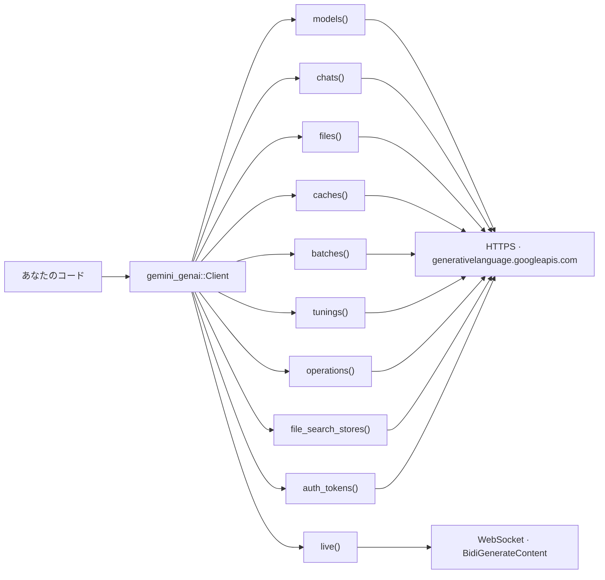

# gemini-genai

> **非公式。** [Google Gen AI Python SDK](https://github.com/googleapis/python-genai)
> （`google-genai` 2.19.0）を **Gemini Developer API** 向けに Rust へ移植した
> 独立プロジェクトであり、Google とは無関係で、Google による承認も後援も受けていない。
> 一部は `google-genai`（Copyright 2025 Google LLC、Apache License 2.0）に由来する
> — [NOTICE](NOTICE) を参照。

Google Gen AI Python SDK を Gemini Developer API 向けに Rust へ移植したクレート。

English version: [README.md](README.md)

## 目次

- [概要](#概要)
- [インストール](#インストール)
  - [Git から](#git-から)
  - [ローカルチェックアウトから](#ローカルチェックアウトから)
  - [併せて必要な依存クレート](#併せて必要な依存クレート)
- [認証](#認証)
- [Cargo フィーチャー](#cargo-フィーチャー)
- [クイックスタート](#クイックスタート)
  - [1. テキスト生成](#1-テキスト生成)
  - [2. ストリーミング](#2-ストリーミング)
  - [3. マルチターンチャット](#3-マルチターンチャット)
  - [4. 構造化出力](#4-構造化出力)
  - [5. 自動関数呼び出し](#5-自動関数呼び出し)
- [基本の先へ](#基本の先へ)
- [Python と Rust の対応](#python-と-rust-の対応)
- [サンプル](#サンプル)
- [開発](#開発)
- [ライブ E2E テスト](#ライブ-e2e-テスト)
- [ライセンス](#ライセンス)

## 概要

呼び出しの形は Python SDK をそのままなぞっている
（`client.<module>().<method>(model, contents, config).await`）。
一方で中身は Rust のイディオムに寄せてあって、例外ではなく型付きエラー、キーワード引数ではなく
`..Default::default()` を使った設定構造体、ジェネレータではなく `Stream` / `Pager` という作り。

スコープは意図的に絞ってあり、**Gemini Developer API のみ**を対象とする。Vertex AI は未実装。
中途半端に動くくらいなら落とす方針なので、Vertex を要求した場合
（`ClientBuilder::vertexai(true)`、`project` / `location`、`GOOGLE_GENAI_USE_VERTEXAI=1`）は
`Error::UnsupportedBackend` で即座に失敗する。



名前が 2 つある点に注意。**クレート名**は `gemini-genai`、**ライブラリ名**は
`gemini_genai`。依存に書くのは前者で、`use` するのは後者。

## インストール

まだ **crates.io には公開していない**ので、バージョン番号ではなくリポジトリを直接指定する。
必要な Rust は 1.88 以降。非同期 API を使うなら Tokio ランタイムが要るけれど、
ランタイムを持ち込みたくない場合は `blocking` フィーチャーが自前のランタイムを用意してくれる。

### Git から

```toml
[dependencies]
gemini-genai = { git = "https://github.com/siosig/genai-rs", branch = "main" }
```

`cargo add --git https://github.com/siosig/genai-rs gemini-genai` でも同じ。

解決されたコミットは `Cargo.lock` に記録されるものの、`branch = "main"` のままだと
`cargo update` のたびに動く。更新のタイミングを自分で握りたいならコミットを固定する。

```toml
gemini-genai = { git = "https://github.com/siosig/genai-rs", rev = "5d38819" }
```

### ローカルチェックアウトから

```toml
[dependencies]
gemini-genai = { path = "../genai-rs" }
```

自分のワークスペースの `members` に checkout を足すより、`path` 依存にした方がいい。
`rust-toolchain.toml` はワークスペースルートのものしか効かないし、`members` に入れると
`cargo test --workspace` / `cargo clippy --workspace` がこのクレートのテスト一式と厳しめの
lint（`missing_docs`、`unsafe_code`、`clippy::unwrap_used`、`clippy::expect_used` がすべて
`deny`）まで巻き込んでビルドし始めるため。

### 併せて必要な依存クレート

`Client`、`Error`、`Result`、`Pager` と各ワイヤ型はこのクレート自身が提供する。
ただし公開 API が*土台にしている*クレートは re-export していないので、実際に触るものだけ
自分で追加する。

```toml
[dependencies]
tokio = { version = "1", features = ["rt-multi-thread", "macros"] }  # 非同期 API
futures-util = "0.3"    # StreamExt。ストリーミングと Pager::into_stream 用
serde = { version = "1", features = ["derive"] }  # 構造化出力 / AFC の引数
schemars = "1"          # with_json_schema_of::<T>()、Tool::from_function
serde_json = "1"        # 関数ツールの戻り値
```

常に要るのは `tokio` だけ（`blocking` フィーチャーならそれすら不要）。単純な
`generate_content` を呼ぶだけなら、このリストの他は何も要らない。

クレート名とライブラリ名が違う点をふまえて、次のように書く。

```rust
use gemini_genai::Client;
```

本格的に書き始める前に配線だけ確認したいなら、依存解決だけのスモークテストとして次を実行する。

```sh
cargo build && cargo tree -p gemini-genai --depth 0
```

## 認証

`Client::new()` は環境変数から API キーを解決する。

| 変数 | 効果 |
|---|---|
| `GOOGLE_API_KEY` | API キー。こちらが優先。 |
| `GEMINI_API_KEY` | `GOOGLE_API_KEY` が未設定のときのフォールバック。両方設定すると警告を出して `GOOGLE_API_KEY` を使う。 |
| `GOOGLE_GEMINI_BASE_URL` | API のベース URL を上書き（ビルダー側で既に指定済みの場合を除く）。 |
| `GOOGLE_GENAI_USE_VERTEXAI` | `1` / `true` / `yes` で Vertex AI を選択。本クレートは未実装なので `build()` が `Error::UnsupportedBackend` を返す。 |

どちらのキーも未設定ならパニックではなく `Error::Validation` になる。環境変数を一切使わない場合は次のとおり。

```rust,no_run
# fn main() -> gemini_genai::Result<()> {
use gemini_genai::Client;
use gemini_genai::types::{HttpOptions, HttpRetryOptions};

let client = Client::builder()
    .api_key(std::env::var("MY_OWN_KEY_VAR").unwrap_or_default())
    .http_options(HttpOptions {
        timeout: Some(30_000), // ミリ秒
        // 未設定なら 1 回試行のみ。Python SDK のデフォルトと同じ挙動。
        retry_options: Some(HttpRetryOptions::default()),
        ..Default::default()
    })
    .build()?;
# let _ = client;
# Ok(())
# }
```

## Cargo フィーチャー

| フィーチャー | デフォルト | 有効になるもの |
|---|---|---|
| `rustls-tls` | ✅ | HTTPS と WebSocket の両方で `rustls` + `webpki-roots` による TLS。システムの OpenSSL は不要。 |
| `native-tls` | — | プラットフォーム標準の TLS スタックを使う。両方が混ざらないよう `default-features` は off にすること。 |
| `live` | ✅ | `client.live()`：双方向リアルタイム（WebSocket）API と `client.live().music()`。 |
| `blocking` | — | `gemini_genai::blocking`：Live を除く API 全体の同期版（`async fn` ではなく `fn`）ミラー。 |
| `mcp` | — | `gemini_genai::mcp::mcp_tools`：MCP サーバーのツールを関数呼び出しツールとしてモデルに公開する。 |

デフォルトの `rustls` ではなく `native-tls` を使う場合。

```toml
[dependencies]
gemini-genai = { git = "https://github.com/siosig/genai-rs", branch = "main", default-features = false, features = ["native-tls", "live"] }
```

フィーチャーを差し替えるときは必ず `default-features = false` とセットで指定する。そうしないと
`rustls-tls` が残ったままになり、TLS スタックが 2 つコンパイルされる。

## クイックスタート

以下のスニペットはすべて `GOOGLE_API_KEY`（または `GEMINI_API_KEY`）が設定済みである前提。

モデル名に `gemini-flash-latest` を使っているのは意図的。`gemini-2.5-flash` のような固定
スナップショットは新規プロジェクト向けに提供が終了して 404 を返すようになるけれど、
`*-latest` エイリアスは動き続けるため。

### 1. テキスト生成

```rust,no_run
use gemini_genai::{Client, Result};

#[tokio::main]
async fn main() -> Result<()> {
    let client = Client::new()?;
    let response = client
        .models()
        .generate_content("gemini-flash-latest", "Why is the sky blue?", None)
        .await?;

    println!("{}", response.text().unwrap_or_default());
    if let Some(usage) = &response.usage_metadata {
        println!("tokens: {:?}", usage.total_token_count);
    }
    Ok(())
}
```

`contents` は `impl Into<Contents>` なので、`&str`、`String`、`Part`、`Vec<Part>`、`Content`、
`Vec<Content>` のどれでも渡せる。マルチモーダルのケースは単なる `Vec<Part>`。

```rust,no_run
# async fn run(client: gemini_genai::Client, png: Vec<u8>) -> gemini_genai::Result<()> {
use gemini_genai::types::Part;

let contents = vec![
    Part::from_text("What is in this image?"),
    Part::from_bytes(png, "image/png"),
];
let response = client
    .models()
    .generate_content("gemini-flash-latest", contents, None)
    .await?;
# let _ = response;
# Ok(())
# }
```

### 2. ストリーミング

```rust,no_run
use futures_util::StreamExt;
use gemini_genai::{Client, Result};

#[tokio::main]
async fn main() -> Result<()> {
    let client = Client::new()?;
    let stream = client
        .models()
        .generate_content_stream("gemini-flash-latest", "Count from 1 to 5.", None)
        .await?;

    let mut stream = Box::pin(stream);
    while let Some(chunk) = stream.next().await {
        print!("{}", chunk?.text().unwrap_or_default());
    }
    println!();
    Ok(())
}
```

ストリーム途中で失敗した場合は `Err` アイテムが 1 つ流れ、そこでストリームは終了する。

### 3. マルチターンチャット

`Chat` は履歴を蓄積して毎ターン再送する。Python の `chats.Chat` と同じ挙動。

```rust,no_run
use gemini_genai::{Client, Result};

#[tokio::main]
async fn main() -> Result<()> {
    let client = Client::new()?;
    let mut chat = client.chats().create("gemini-flash-latest", None, None);

    chat.send_message("My favourite colour is teal. Remember it.", None)
        .await?;
    let answer = chat
        .send_message("What is my favourite colour?", None)
        .await?;
    println!("{}", answer.text().unwrap_or_default());

    // `false` = 網羅履歴（全ターン）、`true` = キュレート済み履歴
    // （不正なモデルターンを除外）
    println!("{} turns recorded", chat.get_history(false).len());
    Ok(())
}
```

### 4. 構造化出力

`with_json_schema_of::<T>()` は [`schemars`](https://docs.rs/schemars) を使って普通の Rust 型から
レスポンススキーマを導出し、`response_mime_type` を `application/json` に既定設定する。
返ってきた JSON はそのまま `T` にデシリアライズできる。

```rust,no_run
use gemini_genai::Client;
use gemini_genai::types::GenerateContentConfig;

#[derive(Debug, serde::Deserialize, schemars::JsonSchema)]
struct RecipeIdea {
    /// レシピ名
    name: String,
    /// おおよその所要時間（分）
    minutes: u32,
    /// 主な材料
    ingredients: Vec<String>,
}

#[tokio::main]
async fn main() -> Result<(), Box<dyn std::error::Error>> {
    let client = Client::new()?;
    let config = GenerateContentConfig::default().with_json_schema_of::<RecipeIdea>();

    let response = client
        .models()
        .generate_content(
            "gemini-flash-latest",
            "Suggest a quick weeknight pasta recipe.",
            Some(config),
        )
        .await?;

    let recipe: RecipeIdea = serde_json::from_str(&response.text().unwrap_or_default())?;
    println!("{recipe:?}");
    Ok(())
}
```

ワイヤ上のスキーマを厳密に制御したいときは、`types::Schema` を手で組み立てて
`response_schema` に設定してもいい。

### 5. 自動関数呼び出し

`function_tool` は非同期の Rust 関数をモデルから呼べるツールとしてラップする。
`Tool::from_function` でそれを宣言すると、`generate_content` が呼び出しと応答のループを
（`maximum_remote_calls`、既定 10 回まで）自動で回してから最終回答を返す。

```rust,no_run
use gemini_genai::afc::function_tool;
use gemini_genai::types::{GenerateContentConfig, Tool};
use gemini_genai::{Client, Result};

#[derive(serde::Deserialize, schemars::JsonSchema)]
struct GetWeatherArgs {
    /// 調べる都市名。例: "Tokyo"
    location: String,
}

async fn get_weather(args: GetWeatherArgs) -> Result<serde_json::Value> {
    Ok(serde_json::json!({ "location": args.location, "temperature_celsius": 24 }))
}

#[tokio::main]
async fn main() -> Result<()> {
    let client = Client::new()?;
    let config = GenerateContentConfig {
        tools: Some(vec![Tool::from_function(function_tool(
            "get_weather",
            "Gets the current weather for a city.",
            get_weather,
        ))]),
        ..Default::default()
    };

    let response = client
        .models()
        .generate_content(
            "gemini-flash-latest",
            "What's the weather in Tokyo right now?",
            Some(config),
        )
        .await?;

    println!("{}", response.text().unwrap_or_default());
    println!("{:?}", response.automatic_function_calling_history);
    Ok(())
}
```

> **注意 — レジストリはプロセス全体で共有される。** `Tool::from_function` は呼び出し可能な
> オブジェクトを、宣言された関数名をキーにしてプロセスグローバルなマップへ格納する。`Tool` は
> ただのシリアライズ可能な構造体で、`Arc<dyn FunctionTool>` を持たせる場所がないため。
> 同じ名前で*別の*コーラブルを 2 つ登録すると、後勝ちで両方が同じ実装を指すことになる。
> Python は呼び出しごとに `function_map` を組み直すのでこの結合はない。名前は必ずユニークに
> つけること。起動時に一度だけツールを登録する運用ならそもそも踏まない。詳細は `afc`
> モジュールのドキュメントを参照。

`GenerateContentConfig::automatic_function_calling` に
`AutomaticFunctionCallingConfig { disable: Some(true), .. }` を設定すると、生の function-call
パートがそのまま返るので、ループを自分で回せる。

## 基本の先へ

<details>
<summary>リスト系エンドポイントのページング</summary>

```rust,no_run
# async fn run(client: gemini_genai::Client) -> gemini_genai::Result<()> {
use futures_util::StreamExt;

let pager = client.models().list(None).await?;

// 1 ページずつ扱う場合...
println!("{} models on this page", pager.page().len());

// ...または全ページの全アイテムを流す場合。
let mut stream = Box::pin(pager.into_stream());
while let Some(model) = stream.next().await {
    println!("{:?}", model?.name);
}
# Ok(())
# }
```

`Pager::next_page()` は使い切ると `Error::NoMorePages` を返す。Python の `IndexError` に対応。
</details>

<details>
<summary>ファイルのアップロード</summary>

```rust,no_run
# async fn run(client: gemini_genai::Client) -> gemini_genai::Result<()> {
use gemini_genai::files::UploadSource;

// パスから（MIME タイプは拡張子から推測）...
let file = client.files().upload("./notes.txt", None).await?;

// ...またはメモリ上のバイト列から。
let file = client
    .files()
    .upload(
        UploadSource::Bytes {
            data: b"Sphinx of black quartz, judge my vow.".to_vec(),
            mime_type: "text/plain".to_owned(),
        },
        None,
    )
    .await?;

let name = file.name.clone().unwrap_or_default();
let fetched = client.files().get(&name, None).await?;
client.files().delete(&name, None).await?;
# let _ = fetched;
# Ok(())
# }
```
</details>

<details>
<summary>同期 API（<code>blocking</code> フィーチャー）</summary>

```rust,no_run
use gemini_genai::blocking::Client;

fn main() -> gemini_genai::Result<()> {
    let client = Client::new()?;
    let response = client
        .models()
        .generate_content("gemini-flash-latest", "Why is the sky blue?", None)?;
    println!("{}", response.text().unwrap_or_default());
    Ok(())
}
```

blocking の `Client` は current-thread の Tokio ランタイムを 1 つ内部に持つ。既存のランタイム
（`#[tokio::main]`、`#[tokio::test]`、Tokio のワーカースレッド）の*中*から生成・呼び出しを
行った場合はパニックせず `Error::BlockingInsideRuntime` を返す。ストリームは
`Iterator<Item = Result<T>>` に、`Pager` は `blocking::Pager` になる。Live に blocking 版は
ない。Python SDK でも async 専用だから。
</details>

<details>
<summary>Live（リアルタイム WebSocket）セッション</summary>

```rust,no_run
# async fn run(client: gemini_genai::Client) -> gemini_genai::Result<()> {
use futures_util::StreamExt;
use gemini_genai::types::Content;

let mut session = client
    .live()
    .connect("gemini-3.1-flash-live-preview", None)
    .await?;

session
    .send_client_content(Some(vec![Content::from("Hello!")]), true)
    .await?;

let mut messages = Box::pin(session.receive());
while let Some(message) = messages.next().await {
    let message = message?;
    if message.server_content.as_ref().and_then(|c| c.turn_complete) == Some(true) {
        break;
    }
}
drop(messages);
session.close().await?;
# Ok(())
# }
```

`connect` は `setup` / `setupComplete` のハンドシェイクを済ませてから返るので、返却された
`LiveSession` はそのまま使える。`client.live().music()` はリアルタイム音楽生成セッションを開く。
</details>

<details>
<summary>エラーハンドリング</summary>

```rust
use gemini_genai::Error;

fn retryable(error: &Error) -> bool {
    match error {
        Error::Api(api) => api.code == 429 || api.is_server_error(),
        Error::Http(http) => http.is_timeout() || http.is_connect(),
        _ => false,
    }
}
```

`Error::Api` は `code`、`status`、`message`、`details`、`response_headers` を持つ boxed な
`ApiError` を運ぶ。他のバリアントは、トランスポート（`Http`）、シリアライズ／デシリアライズ
（`Json`）、ローカル I/O（`Io`）、クライアント側バリデーション（`Validation`）、Vertex 専用
フィールド（`UnsupportedByBackend`）、未実装バックエンド（`UnsupportedBackend`）、関数呼び出し
（`FunctionCall`）、ストリーム（`Stream`）、レジューム可能アップロード（`Upload`）、ページング
（`NoMorePages`）、blocking API の誤用（`BlockingInsideRuntime`）をカバーする。
</details>

## Python と Rust の対応

- [`docs/parity.ja.md`](docs/parity.ja.md) — 自動生成。Python の全メソッド・全型と、その Rust 側の
  対応物、そして意図的に移植していないものの一覧。
- [`docs/migrating-from-python.ja.md`](docs/migrating-from-python.ja.md) — イディオムの違い（設定
  構造体、`Contents` の変換、ストリーム、ページャ、エラー）についてのガイド。

0.1.0 で未実装なもの: Vertex AI バックエンド、および Vertex 専用・Python 固有の API 面。
`models.compute_tokens` と `tunings.list` は存在するけれど常にエラーを返す。
`models.edit_image` / `upscale_image` / `recontext_image` / `segment_image` と
`tunings.validate_reward` は存在しない（Python でも Vertex AI 以外では `ValueError` になる）。
`local_tokenizer`、NextGen の `interactions` / `agents` / `webhooks` / `triggers` /
`environments` モジュール、replay / `DebugConfig` の仕組みは移植していない。詳細は
[CHANGELOG.md](CHANGELOG.md) を参照。

## サンプル

`examples/` に実行可能な形で置いてある。

| サンプル | 内容 |
|---|---|
| `multimodal.rs` | テキストプロンプトとインライン画像バイト列の併用 |
| `structured_output.rs` | Rust の型から導出した JSON 出力 |
| `function_calling.rs` | 自動関数呼び出しの一連の流れ |

```sh
GOOGLE_API_KEY=... cargo run --example structured_output
```

## 開発

コントリビューションガイド: [CONTRIBUTING.ja.md](CONTRIBUTING.ja.md) — フックの
初回設定、5 つの品質ゲート、コード生成の手順、ピンした依存の更新方法。
セキュリティ上の問題は [SECURITY.ja.md](SECURITY.ja.md) へ。

`src/types/generated/`、`src/converters/generated/`、`src/blocking/generated.rs`、
`tests/fixtures/` の大部分は、インストール済みの Python SDK から自動生成している。これらを手で
編集しないこと。ジェネレータ本体か `tools/codegen/` 配下のオーバーライドを変更して再生成する。

```sh
pip install -r tools/codegen/requirements.txt
python tools/codegen/generate.py
```

CI はジェネレータを再実行して差分が出たら失敗するので、ジェネレータの変更と再生成結果は
一緒にコミットする必要がある。

品質ゲート。次の 4 つはすべてクリーンに保つ。

```sh
cargo fmt --all --check
cargo clippy --all-targets --all-features -- -D warnings
cargo test --all-features
RUSTDOCFLAGS="-D warnings" cargo doc --no-deps --all-features
```

`missing_docs`、`unsafe_code`、`clippy::unwrap_used`、`clippy::expect_used` はクレートレベルで
すべて `deny`。規約の全体は [AGENTS.md](AGENTS.md) を参照。

## ライブ E2E テスト

`tests/e2e.rs` は実 API を叩く。全テストが `#[ignore]` 済みなので、素の `cargo test` でクォータを
消費することはない。

```sh
GEMINI_API_KEY=... cargo test --all-features --test e2e -- --ignored
```

キーが無い場合は失敗ではなくスキップになるため、シークレットを持たない CI でも `--ignored` を
実行できる。

`tests/e2e_expensive.rs` は動画生成、バッチジョブ、Live セッションをカバーする。クォータの消費が
大きい、あるいは数分かかるものなので、もう一段の opt-in が必要。

```sh
GEMINI_API_KEY=... GENAI_E2E_EXPENSIVE=1 \
  cargo test --all-features --test e2e_expensive -- --ignored --nocapture
```

## ライセンス

Apache-2.0 — 全文は [LICENSE](LICENSE) を参照。

本クレートの一部は Google Gen AI Python SDK（`google-genai` 2.19.0、
Copyright 2025 Google LLC、同じく Apache-2.0）に由来する。どのパスが該当し
何を改変したかは [NOTICE](NOTICE) に記載している。

「Google」「Gemini」は Google LLC の商標。Apache-2.0 は商標の許諾を与えない
（第 6 条）。本プロジェクトは Google とは無関係で、承認も後援も受けていない。
