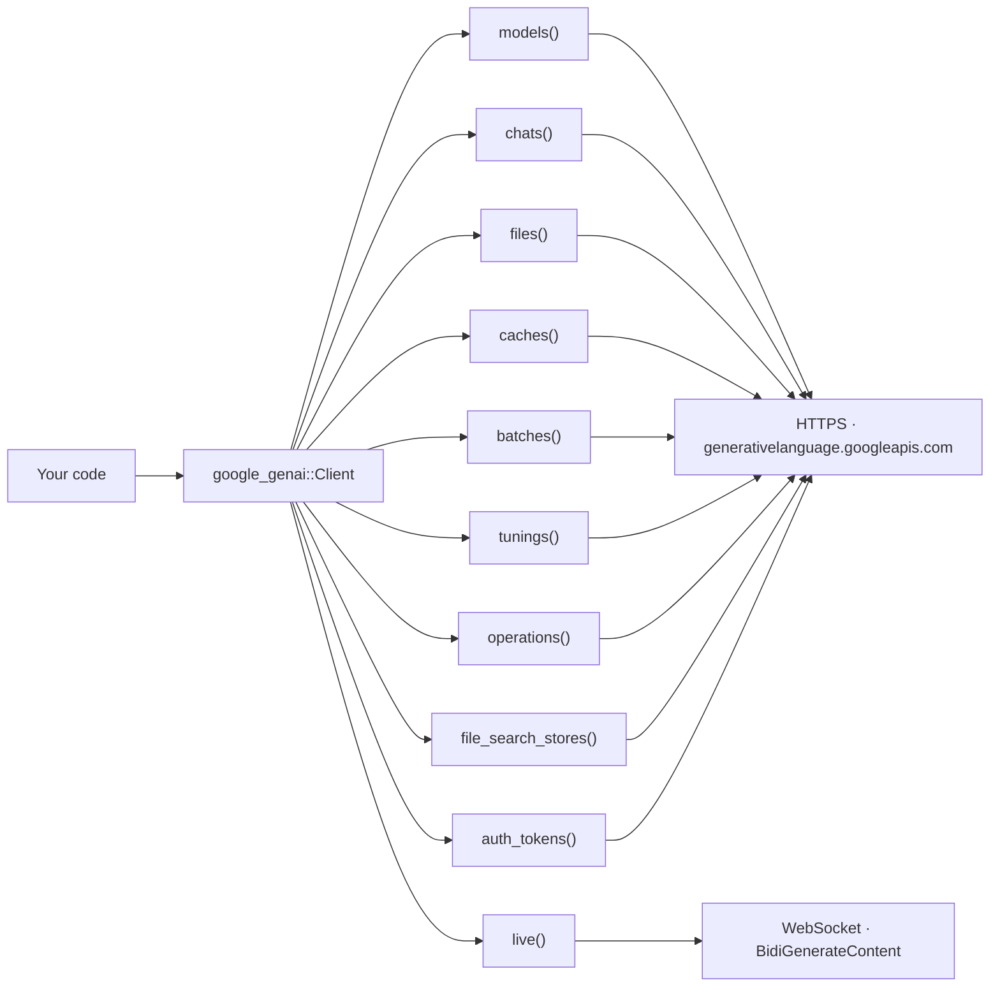

# google-genai-rs

Rust port of the [Google Gen AI Python SDK](https://github.com/googleapis/python-genai)
(`google-genai` 2.19.0) for the **Gemini Developer API**.

## Table of Contents

- [Overview](#overview)
- [Installation](#installation)
- [Authentication](#authentication)
- [Cargo features](#cargo-features)
- [Quickstart](#quickstart)
  - [1. Text generation](#1-text-generation)
  - [2. Streaming](#2-streaming)
  - [3. Multi-turn chat](#3-multi-turn-chat)
  - [4. Structured output](#4-structured-output)
  - [5. Automatic function calling](#5-automatic-function-calling)
- [Beyond the basics](#beyond-the-basics)
- [Python ↔ Rust mapping](#python--rust-mapping)
- [Examples](#examples)
- [Development](#development)
- [Live end-to-end tests](#live-end-to-end-tests)
- [License](#license)

## Overview

The crate mirrors the Python SDK's shape — `client.<module>().<method>(model, contents, config).await`
— while staying idiomatic Rust: typed errors instead of exceptions, config structs
with `..Default::default()` instead of keyword arguments, and `Stream`/`Pager`
instead of generators.

Scope is deliberately narrow: **the Gemini Developer API only**. Vertex AI is not
implemented. Asking for it (`ClientBuilder::vertexai(true)`, `project`/`location`,
or `GOOGLE_GENAI_USE_VERTEXAI=1`) fails fast with `Error::UnsupportedBackend`
rather than half-working.



Note the naming split: the **crate** is `google-genai-rs`, the **library** is
`google_genai`. You install the former and `use` the latter.

## Installation

```sh
cargo add google-genai-rs
```

```rust
use google_genai::Client;
```

Requires Rust 1.85 (edition 2024) or newer, and a Tokio runtime for the async API.
The `blocking` feature brings its own runtime if you would rather not.

## Authentication

`Client::new()` resolves the API key from the environment:

| Variable | Effect |
|---|---|
| `GOOGLE_API_KEY` | The API key. Preferred. |
| `GEMINI_API_KEY` | Fallback, used when `GOOGLE_API_KEY` is unset. Setting both logs a warning and uses `GOOGLE_API_KEY`. |
| `GOOGLE_GEMINI_BASE_URL` | Overrides the API base URL, unless the builder already set one. |
| `GOOGLE_GENAI_USE_VERTEXAI` | `1`/`true`/`yes` selects Vertex AI — which this crate does not implement, so `build()` returns `Error::UnsupportedBackend`. |

Neither key set is an `Error::Validation`, not a panic. To skip the environment
entirely:

```rust,no_run
# fn main() -> google_genai::Result<()> {
use google_genai::Client;
use google_genai::types::{HttpOptions, HttpRetryOptions};

let client = Client::builder()
    .api_key(std::env::var("MY_OWN_KEY_VAR").unwrap_or_default())
    .http_options(HttpOptions {
        timeout: Some(30_000), // milliseconds
        // Unset means a single attempt, matching the Python SDK's default.
        retry_options: Some(HttpRetryOptions::default()),
        ..Default::default()
    })
    .build()?;
# let _ = client;
# Ok(())
# }
```

## Cargo features

| Feature | Default | What it enables |
|---|---|---|
| `rustls-tls` | ✅ | TLS through `rustls` + `webpki-roots` for both HTTPS and WebSocket. No system OpenSSL needed. |
| `native-tls` | — | TLS through the platform's native stack instead. Turn `default-features` off to avoid pulling in both. |
| `live` | ✅ | `client.live()`: the bidirectional realtime (WebSocket) API, plus `client.live().music()`. |
| `blocking` | — | `google_genai::blocking`: a synchronous (`fn`, not `async fn`) mirror of the whole API, minus Live. |
| `mcp` | — | `google_genai::mcp::mcp_tools`: exposes an MCP server's tools to the model as function-calling tools. |
| `live-tests` | — | Opt-in flag for this repository's own network-dependent tests. No effect on library code. |

To use `native-tls` instead of the default `rustls`:

```toml
[dependencies]
google-genai-rs = { version = "0.1", default-features = false, features = ["native-tls", "live"] }
```

## Quickstart

Every snippet below assumes `GOOGLE_API_KEY` (or `GEMINI_API_KEY`) is set.

`gemini-flash-latest` is used throughout on purpose: pinned snapshots such as
`gemini-2.5-flash` get retired for new projects and start returning 404, while the
`*-latest` aliases keep working.

### 1. Text generation

```rust,no_run
use google_genai::{Client, Result};

#[tokio::main]
async fn main() -> Result<()> {
    let client = Client::new()?;
    let response = client
        .models()
        .generate_content("gemini-flash-latest", "Why is the sky blue?", None)
        .await?;

    println!("{}", response.text().unwrap_or_default());
    if let Some(usage) = &response.usage_metadata {
        println!("tokens: {:?}", usage.total_token_count);
    }
    Ok(())
}
```

`contents` is `impl Into<Contents>`, so a `&str`, a `String`, a `Part`, a
`Vec<Part>`, a `Content`, or a `Vec<Content>` all work — the multimodal case is
just a `Vec<Part>`:

```rust,no_run
# async fn run(client: google_genai::Client, png: Vec<u8>) -> google_genai::Result<()> {
use google_genai::types::Part;

let contents = vec![
    Part::from_text("What is in this image?"),
    Part::from_bytes(png, "image/png"),
];
let response = client
    .models()
    .generate_content("gemini-flash-latest", contents, None)
    .await?;
# let _ = response;
# Ok(())
# }
```

### 2. Streaming

```rust,no_run
use futures_util::StreamExt;
use google_genai::{Client, Result};

#[tokio::main]
async fn main() -> Result<()> {
    let client = Client::new()?;
    let stream = client
        .models()
        .generate_content_stream("gemini-flash-latest", "Count from 1 to 5.", None)
        .await?;

    let mut stream = Box::pin(stream);
    while let Some(chunk) = stream.next().await {
        print!("{}", chunk?.text().unwrap_or_default());
    }
    println!();
    Ok(())
}
```

A mid-stream failure surfaces as one `Err` item, after which the stream ends.

### 3. Multi-turn chat

`Chat` accumulates history and replays it on every turn, exactly like Python's
`chats.Chat`.

```rust,no_run
use google_genai::{Client, Result};

#[tokio::main]
async fn main() -> Result<()> {
    let client = Client::new()?;
    let mut chat = client.chats().create("gemini-flash-latest", None, None);

    chat.send_message("My favourite colour is teal. Remember it.", None)
        .await?;
    let answer = chat
        .send_message("What is my favourite colour?", None)
        .await?;
    println!("{}", answer.text().unwrap_or_default());

    // `false` = comprehensive history (every turn); `true` = curated
    // (invalid model turns dropped).
    println!("{} turns recorded", chat.get_history(false).len());
    Ok(())
}
```

### 4. Structured output

`with_json_schema_of::<T>()` derives the response schema from a plain Rust type
via [`schemars`](https://docs.rs/schemars), and defaults `response_mime_type` to
`application/json`. The reply then deserializes straight back into `T`.

```rust,no_run
use google_genai::Client;
use google_genai::types::GenerateContentConfig;

#[derive(Debug, serde::Deserialize, schemars::JsonSchema)]
struct RecipeIdea {
    /// The recipe's name.
    name: String,
    /// Roughly how long it takes, in minutes.
    minutes: u32,
    /// The main ingredients.
    ingredients: Vec<String>,
}

#[tokio::main]
async fn main() -> Result<(), Box<dyn std::error::Error>> {
    let client = Client::new()?;
    let config = GenerateContentConfig::default().with_json_schema_of::<RecipeIdea>();

    let response = client
        .models()
        .generate_content(
            "gemini-flash-latest",
            "Suggest a quick weeknight pasta recipe.",
            Some(config),
        )
        .await?;

    let recipe: RecipeIdea = serde_json::from_str(&response.text().unwrap_or_default())?;
    println!("{recipe:?}");
    Ok(())
}
```

Building a `types::Schema` by hand and setting `response_schema` works too, when
you want exact control over the wire schema.

### 5. Automatic function calling

`function_tool` wraps an async Rust function as a model-callable tool;
`Tool::from_function` declares it, and `generate_content` then drives the whole
call/response loop (up to `maximum_remote_calls`, default 10) before returning the
final answer.

```rust,no_run
use google_genai::afc::function_tool;
use google_genai::types::{GenerateContentConfig, Tool};
use google_genai::{Client, Result};

#[derive(serde::Deserialize, schemars::JsonSchema)]
struct GetWeatherArgs {
    /// The city to look up, e.g. "Tokyo".
    location: String,
}

async fn get_weather(args: GetWeatherArgs) -> Result<serde_json::Value> {
    Ok(serde_json::json!({ "location": args.location, "temperature_celsius": 24 }))
}

#[tokio::main]
async fn main() -> Result<()> {
    let client = Client::new()?;
    let config = GenerateContentConfig {
        tools: Some(vec![Tool::from_function(function_tool(
            "get_weather",
            "Gets the current weather for a city.",
            get_weather,
        ))]),
        ..Default::default()
    };

    let response = client
        .models()
        .generate_content(
            "gemini-flash-latest",
            "What's the weather in Tokyo right now?",
            Some(config),
        )
        .await?;

    println!("{}", response.text().unwrap_or_default());
    println!("{:?}", response.automatic_function_calling_history);
    Ok(())
}
```

> **Caveat — the registry is process-wide.** `Tool::from_function` stores the
> callable in a process-global map keyed by the declared function name, because
> `Tool` is a plain serializable struct with nowhere to carry an
> `Arc<dyn FunctionTool>`. Registering two *different* callables under the same
> name means the later one wins for both. Python rebuilds its `function_map` per
> call and has no such coupling. Give each callable a unique name — registering
> tools once at startup sidesteps it entirely. See the `afc` module docs.

Set `GenerateContentConfig::automatic_function_calling` to
`AutomaticFunctionCallingConfig { disable: Some(true), .. }` to get the raw
function-call parts back instead and drive the loop yourself.

## Beyond the basics

<details>
<summary>Paging through list endpoints</summary>

```rust,no_run
# async fn run(client: google_genai::Client) -> google_genai::Result<()> {
use futures_util::StreamExt;

let pager = client.models().list(None).await?;

// One page at a time...
println!("{} models on this page", pager.page().len());

// ...or every item across every page.
let mut stream = Box::pin(pager.into_stream());
while let Some(model) = stream.next().await {
    println!("{:?}", model?.name);
}
# Ok(())
# }
```

`Pager::next_page()` returns `Error::NoMorePages` once exhausted, mirroring
Python's `IndexError`.
</details>

<details>
<summary>Uploading a file</summary>

```rust,no_run
# async fn run(client: google_genai::Client) -> google_genai::Result<()> {
use google_genai::files::UploadSource;

// From a path (MIME type inferred from the extension)...
let file = client.files().upload("./notes.txt", None).await?;

// ...or from bytes already in memory.
let file = client
    .files()
    .upload(
        UploadSource::Bytes {
            data: b"Sphinx of black quartz, judge my vow.".to_vec(),
            mime_type: "text/plain".to_owned(),
        },
        None,
    )
    .await?;

let name = file.name.clone().unwrap_or_default();
let fetched = client.files().get(&name, None).await?;
client.files().delete(&name, None).await?;
# let _ = fetched;
# Ok(())
# }
```
</details>

<details>
<summary>Synchronous API (<code>blocking</code> feature)</summary>

```rust,no_run
use google_genai::blocking::Client;

fn main() -> google_genai::Result<()> {
    let client = Client::new()?;
    let response = client
        .models()
        .generate_content("gemini-flash-latest", "Why is the sky blue?", None)?;
    println!("{}", response.text().unwrap_or_default());
    Ok(())
}
```

Each blocking `Client` owns one current-thread Tokio runtime. Constructing or
calling one from *inside* an existing runtime (`#[tokio::main]`,
`#[tokio::test]`, a Tokio worker thread) returns `Error::BlockingInsideRuntime`
rather than panicking. Streams become `Iterator<Item = Result<T>>`; `Pager`
becomes `blocking::Pager`. Live has no blocking equivalent — it is
async-only in the Python SDK too.
</details>

<details>
<summary>Live (realtime WebSocket) sessions</summary>

```rust,no_run
# async fn run(client: google_genai::Client) -> google_genai::Result<()> {
use futures_util::StreamExt;
use google_genai::types::Content;

let mut session = client
    .live()
    .connect("gemini-3.1-flash-live-preview", None)
    .await?;

session
    .send_client_content(Some(vec![Content::from("Hello!")]), true)
    .await?;

let mut messages = Box::pin(session.receive());
while let Some(message) = messages.next().await {
    let message = message?;
    if message.server_content.as_ref().and_then(|c| c.turn_complete) == Some(true) {
        break;
    }
}
drop(messages);
session.close().await?;
# Ok(())
# }
```

`connect` performs the `setup`/`setupComplete` handshake before returning, so a
returned `LiveSession` is ready to use. `client.live().music()` opens realtime
music-generation sessions.
</details>

<details>
<summary>Error handling</summary>

```rust
use google_genai::Error;

fn retryable(error: &Error) -> bool {
    match error {
        Error::Api(api) => api.code == 429 || api.is_server_error(),
        Error::Http(http) => http.is_timeout() || http.is_connect(),
        _ => false,
    }
}
```

`Error::Api` carries a boxed `ApiError` with `code`, `status`, `message`,
`details`, and `response_headers`. Other variants cover transport (`Http`),
(de)serialization (`Json`), local I/O (`Io`), client-side validation
(`Validation`), Vertex-only fields (`UnsupportedByBackend`), unimplemented
backends (`UnsupportedBackend`), function calling (`FunctionCall`), streams
(`Stream`), resumable uploads (`Upload`), pagination (`NoMorePages`), and misuse
of the blocking API (`BlockingInsideRuntime`).
</details>

## Python ↔ Rust mapping

- [`docs/parity.md`](docs/parity.md) — generated: every Python method and type,
  its Rust counterpart, and what is deliberately not ported.
- [`docs/migrating-from-python.md`](docs/migrating-from-python.md) — a guide to
  the idiom differences (config structs, `Contents` conversions, streams, pagers,
  errors).

Not implemented in 0.1.0: the Vertex AI backend, and the Python surfaces that are
Vertex-only or Python-specific — `models.compute_tokens` and `tunings.list` are
present but always error; `models.edit_image` / `upscale_image` /
`recontext_image` / `segment_image` and `tunings.validate_reward` are absent
(Python raises `ValueError` for all of them outside Vertex AI); `local_tokenizer`,
the NextGen `interactions`/`agents`/`webhooks`/`triggers`/`environments` modules,
and the replay/`DebugConfig` machinery are not ported. See
[CHANGELOG.md](CHANGELOG.md).

## Examples

Runnable, in `examples/`:

| Example | Shows |
|---|---|
| `multimodal.rs` | Inline image bytes alongside a text prompt |
| `structured_output.rs` | JSON output derived from a Rust type |
| `function_calling.rs` | Automatic function calling end to end |

```sh
GOOGLE_API_KEY=... cargo run --example structured_output
```

## Development

Most of `src/types/generated/`, `src/converters/generated/`,
`src/blocking/generated.rs`, and `tests/fixtures/` is generated from the installed
Python SDK. Do not hand-edit those; change the generator or its overrides under
`tools/codegen/` and regenerate:

```sh
pip install -r tools/codegen/requirements.txt
python tools/codegen/generate.py
```

CI re-runs the generator and fails on any diff, so regenerated output must be
committed alongside generator changes.

Quality gates — all four must stay clean:

```sh
cargo fmt --all --check
cargo clippy --all-targets --all-features -- -D warnings
cargo test --all-features
RUSTDOCFLAGS="-D warnings" cargo doc --no-deps --all-features
```

`missing_docs`, `unsafe_code`, `clippy::unwrap_used`, and `clippy::expect_used`
are all `deny` at the crate level. See [AGENTS.md](AGENTS.md) for the full
convention set.

## Live end-to-end tests

`tests/e2e.rs` exercises the real API. Every test is `#[ignore]`d, so a plain
`cargo test` never spends quota:

```sh
GEMINI_API_KEY=... cargo test --all-features --test e2e -- --ignored
```

Without a key the tests skip rather than fail, which keeps `--ignored` runnable in
CI without secrets.

`tests/e2e_expensive.rs` covers video generation, batch jobs, and Live sessions.
Those cost meaningfully more quota or take minutes, so they need a second opt-in:

```sh
GEMINI_API_KEY=... GENAI_E2E_EXPENSIVE=1 \
  cargo test --all-features --test e2e_expensive -- --ignored --nocapture
```

## License

Apache-2.0.

This is an independent port and is not an official Google product.
