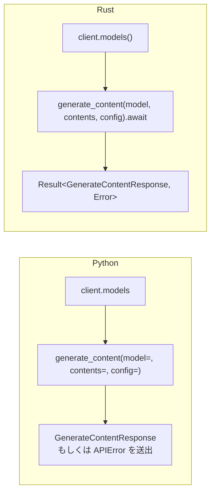

# `google-genai` Python SDK からの移行

English version: [migrating-from-python.md](migrating-from-python.md)

## 目次

- [概要](#概要)
- [クライアントの生成](#クライアントの生成)
- [同期と非同期](#同期と非同期)
- [`contents` の渡し方](#contents-の渡し方)
- [設定は kwargs ではなく構造体](#設定は-kwargs-ではなく構造体)
- [エラーハンドリング](#エラーハンドリング)
- [ストリーミング](#ストリーミング)
- [ページング](#ページング)
- [自動関数呼び出し](#自動関数呼び出し)
- [MCP ツール](#mcp-ツール)
- [ライブセッション](#ライブセッション)
- [Python SDK との既知の差分](#python-sdk-との既知の差分)
- [完全な対応表](#完全な対応表)

## 概要

`gemini_genai` は Python SDK の *形* をそのまま保ち、Rust の言語制約上どうしても変わる部分だけを
変えている。頭の中での変換はほぼ機械的にできる。

| Python | Rust |
|---|---|
| `client.models.generate_content(...)` | `client.models().generate_content(...).await` |
| `model=` / `contents=` / `config=` のキーワード引数 | 位置引数 `(model, contents, config)`（この順） |
| `config=types.XConfig(a=1)` または `config={"a": 1}` | `Some(XConfig { a: Some(1), ..Default::default() })` |
| `config=None`（省略） | `None` |
| 例外（`APIError` / `ValueError`） | `Result<T, gemini_genai::Error>` |
| ジェネレータ（`for chunk in ...`） | `Stream<Item = Result<T>>` |
| `Pager` / `AsyncPager` | `Pager<T>` |
| `client.aio.*`（非同期） | こちらが既定の API — すべて `async fn` |
| `client.*`（同期） | `gemini_genai::blocking::*`（feature `blocking`） |



スコープ面で唯一の大きな違いは、**このクレートが Gemini Developer API だけを実装している**こと。
Vertex AI は移植していない。Vertex 専用の *型* は残っている（型は一括生成しているため）が、
Vertex 専用の *フィールド* はリクエスト時点で `Error::UnsupportedByBackend` として弾かれるし、
そもそも Vertex バックエンドを要求した時点で `Error::UnsupportedBackend` で失敗する。

## クライアントの生成

```python
from google import genai

client = genai.Client()                       # GOOGLE_API_KEY / GEMINI_API_KEY
client = genai.Client(api_key="...")
client = genai.Client(http_options=types.HttpOptions(timeout=30_000))
```

```rust,no_run
use gemini_genai::Client;
use gemini_genai::types::HttpOptions;

# fn main() -> gemini_genai::Result<()> {
let client = Client::new()?;                       // GOOGLE_API_KEY / GEMINI_API_KEY

let client = Client::builder().api_key("...").build()?;

let client = Client::builder()
    .http_options(HttpOptions { timeout: Some(30_000), ..Default::default() })
    .build()?;
# Ok(())
# }
```

環境変数の解決順は Python と同じ。`GOOGLE_API_KEY` が最優先で、`GEMINI_API_KEY` がフォールバック。
両方セットされていれば（`tracing` 経由で）警告を出す。`GOOGLE_GEMINI_BASE_URL` はベース URL を
上書きするが、ビルダー側で既に指定済みならそちらが勝つ。

`Client` は `Clone` かつ内部が `Arc` なので、タスクへクローンして渡すコストはほぼゼロ。
グローバルシングルトンや自前のコネクションプールを用意する必要はない。

Vertex AI 用のつまみはシグネチャ互換のためにビルダー上へ残してあるが、実装はしていない。

```rust,no_run
# use gemini_genai::{Client, Error};
let result = Client::builder().vertexai(true).build();
assert!(matches!(result, Err(Error::UnsupportedBackend("vertexai"))));
```

環境変数 `GOOGLE_GENAI_USE_VERTEXAI=1` も、`project` / `location` の指定も同じ結果になる。

## 同期と非同期

Python SDK は同期が既定で、非同期は `client.aio`。このクレートはそれを逆にしていて、
**非同期が既定**、同期版は `blocking` フィーチャーの裏に置いてある。

```toml
gemini-genai = { version = "0.1", features = ["blocking"] }
```

```rust,no_run
use gemini_genai::blocking::Client;

# fn main() -> gemini_genai::Result<()> {
let client = Client::new()?;
let response = client
    .models()
    .generate_content("gemini-flash-latest", "Hello", None)?;   // .await は不要
# let _ = response;
# Ok(())
# }
```

`blocking::Client` は同じモジュールアクセサ（`models()` / `chats()` / `files()` / `caches()` /
`tunings()` / `batches()` / `operations()` / `file_search_stores()` / `auth_tokens()`）を、
同じメソッド名・同じ引数順で提供する。ただし `live()` はない — Live API は Python でも非同期専用。

押さえておくべき点が 2 つ。

- `blocking::Client` は 1 つにつき専用の **current-thread** Tokio ランタイムを持つ。OS スレッドは
  増えず、すべての呼び出しが呼び出し元スレッド上で非同期グラフを最後まで回す。
- 動作中の Tokio ランタイムの中から blocking メソッドを呼ぶ — *あるいは `blocking::Client` を
  構築するだけでも* — panic ではなく `Error::BlockingInsideRuntime` が返る。構築時点でガードして
  いるのは、`tokio::runtime::Runtime` が非同期コンテキスト内では drop もできないから。放置すると
  無関係な `drop` の位置で謎の panic になる。つまりデッドロックではなくエラーになる。

  ```rust,no_run
  # use gemini_genai::Error;
  #[tokio::main]
  async fn main() {
      let result = gemini_genai::blocking::Client::new();
      assert!(matches!(result, Err(Error::BlockingInsideRuntime)));
  }
  ```

ストリームは `Iterator<Item = Result<T>>`（`blocking::BlockingStream<T>`）に、ページャは
`blocking::Pager<T>` になる。どちらもクライアントと同じランタイムハンドルを保持しているので、
元のクライアントを drop した後も動き続ける。

## `contents` の渡し方

Python は `str | Part | Content | list[...] | PIL.Image | dict` を実行時に強制変換する。Rust は
同じ変換を `types::Contents` の `From` 実装によってコンパイル時に行う。コンテンツを受け取る
メソッドはすべて `impl Into<Contents>` を取る。

| Python | Rust |
|---|---|
| `contents="hello"` | `"hello"`（`&str`）または `String` |
| `contents=types.Part.from_text(text="hi")` | `Part::from_text("hi")` |
| `contents=[part_a, part_b]` | `vec![part_a, part_b]`（`Vec<Part>`） |
| `contents=types.Content(role="user", parts=[...])` | `Content { role: Some("user".into()), parts: Some(vec![...]) }` |
| `contents=[content_a, content_b]` | `Vec<Content>` |

`From` 実装はこれで全部 — `&str` / `String` / `Part` / `Vec<Part>` / `Content` / `Vec<Content>`。
`PIL.Image` 相当はないので、`Part::from_bytes`（またはパスを読んで拡張子から MIME タイプを推測する
`Part::from_file_bytes`）を使う。

素の `Vec<Part>` は単一の `Content` に畳み込まれ、role は推論される。いずれかの part が
`function_call` を持てば `model`、それ以外は `user` — Python と同じ規則。

`Part` のコンストラクタは Python のクラスメソッドと 1 対 1 で対応する。

| Python | Rust |
|---|---|
| `Part.from_text(text=)` | `Part::from_text(text)` |
| `Part.from_bytes(data=, mime_type=)` | `Part::from_bytes(data, mime_type)` |
| `Part.from_uri(file_uri=, mime_type=)` | `Part::from_uri(uri, mime_type)` |
| `Part.from_function_call(name=, args=)` | `Part::from_function_call(name, args)` |
| `Part.from_function_response(name=, response=)` | `Part::from_function_response(name, response)` |
| —（自分でファイルを読んで `from_bytes`） | `Part::from_file_bytes(path)?`（Rust 側の追加） |

## 設定は kwargs ではなく構造体

Python の config オブジェクトはキーワード引数から組み立てる pydantic モデルで、すべて省略可能。
Rust は全フィールドが `Option<T>` のただの構造体なので、イディオムは `..Default::default()` で
締める構造体リテラルになる。

```python
config = types.GenerateContentConfig(
    temperature=0.2,
    max_output_tokens=512,
    system_instruction="Be terse.",
)
```

```rust
use gemini_genai::types::{Content, GenerateContentConfig};

let config = GenerateContentConfig {
    temperature: Some(0.2),
    max_output_tokens: Some(512),
    system_instruction: Some(Content::from("Be terse.")),
    ..Default::default()
};
```

身につけておきたい習慣が 3 つ。

1. **必ず `..Default::default()` で終える。** 生成された型はあえて `#[non_exhaustive]` にして
   いない（構造体リテラルで組み立てられるように）が、上流 SDK の成長に伴ってフィールドは増える。
2. **スカラーは `Some` で包む。** 未指定は番兵値ではなく `None`。
3. **config 自体も省略可能**なので型は `Option<XConfig>`。Python で `config=` を省略する場面では
   `None` を渡す。

構造化出力には専用のショートカットがある。Python は pydantic モデルを `response_schema=` に渡すが、
Rust は `schemars::JsonSchema` を実装した任意の型からスキーマを導出する。

```rust
use gemini_genai::types::GenerateContentConfig;

#[derive(serde::Deserialize, schemars::JsonSchema)]
struct Capital {
    country: String,
    capital: String,
}

// `response_json_schema` をセットし、`response_mime_type` を
// "application/json" に既定設定する。
let config = GenerateContentConfig::default().with_json_schema_of::<Capital>();
```

ワイヤ上のスキーマをバイト単位で制御したいなら、`types::Schema` を手で組んで `response_schema` に
セットする手も使える。

Python SDK から生成した enum には `Unknown(String)` バリアントが付く。サーバー側が後から値を
追加してもデシリアライズが失敗しない代わりに、`match` はキャッチオール腕なしでは網羅にならない。

## エラーハンドリング

Python は送出、Rust は返却。`try`/`except` は `match`（伝播させたいだけなら `?`）に置き換わる。

```python
try:
    response = client.models.generate_content(...)
except errors.ClientError as e:
    if e.code == 429:
        ...
except errors.ServerError:
    ...
```

```rust
use gemini_genai::Error;

fn classify(error: &Error) -> &'static str {
    match error {
        Error::Api(api) if api.code == 429 => "rate limited",
        Error::Api(api) if api.is_client_error() => "bad request",
        Error::Api(api) if api.is_server_error() => "server error, retry",
        Error::Http(_) => "transport failure",
        Error::Validation(_) => "rejected before sending",
        Error::UnsupportedByBackend { .. } => "Vertex-only field on a Gemini client",
        _ => "other",
    }
}
```

Python の例外階層との対応。

| Python | Rust |
|---|---|
| `APIError` / `ClientError` / `ServerError` | `Error::Api(Box<ApiError>)` — `code` / `is_client_error()` / `is_server_error()` で判別 |
| `UnknownApiResponseError` | `Error::Json` |
| `ValueError`（クライアント側バリデーション） | `Error::Validation(String)` |
| `ValueError("... only supported in Vertex AI")` | `Error::UnsupportedByBackend { field, backend }` |
| `UnsupportedFunctionError` / `UnknownFunctionCallArgumentError` / `FunctionInvocationError` | `Error::FunctionCall(FunctionCallError::…)` |
| `pager.next_page()` の `IndexError` | `Error::NoMorePages` |
| `httpx` のネットワーク／タイムアウト例外 | `Error::Http(reqwest::Error)` |
| — | `Error::Stream` / `Error::Upload` / `Error::UnsupportedBackend` / `Error::BlockingInsideRuntime` / `Error::Io` |

`ApiError` は `code` / `status` / `message` / `details` / `response_headers` を保持するので、
Python が公開していた情報は失われない。

## ストリーミング

Python の `generate_content_stream` はジェネレータを返す。Rust が返すのは
`Result<GenerateContentStream>` で、外側の `Result` はリクエストの *開始* 失敗を、各要素の
`Result` はストリーム途中の失敗を表す。

```python
for chunk in client.models.generate_content_stream(model=..., contents=...):
    print(chunk.text, end="")
```

```rust,no_run
# async fn run(client: gemini_genai::Client) -> gemini_genai::Result<()> {
use futures_util::StreamExt;   // `.next()` をスコープに入れる

let stream = client
    .models()
    .generate_content_stream("gemini-flash-latest", "Hello", None)
    .await?;

let mut stream = Box::pin(stream);
while let Some(chunk) = stream.next().await {
    print!("{}", chunk?.text().unwrap_or_default());
}
# Ok(())
# }
```

`futures_util::StreamExt` は忘れられがちな import。これがないと `.next()` は生えない。
`next()` が `Unpin` を要求するので `Box::pin`（または `tokio::pin!`）も必要。

ストリーム途中のエラーはちょうど 1 回だけ `Err` 要素として現れ、そこでストリームは終わる。
エラーを出し続けることはない。

`Chat::send_message_stream` も同じ挙動だが、ルールが 1 つ増える。返される `ChatStream` は `Chat` を
可変借用していて、モデル側のターンを履歴へ書き込むのは**完全に読み切った後**。途中で捨てると
そのターンは記録されない。

## ページング

```python
pager = client.models.list()
print(pager.page_size, len(pager.page))
pager.next_page()          # 尽きると IndexError

for model in client.models.list():   # 全件イテレート
    ...
```

```rust,no_run
# async fn run(client: gemini_genai::Client) -> gemini_genai::Result<()> {
use futures_util::StreamExt;

let mut pager = client.models().list(None).await?;
println!("{} items on this page", pager.page().len());

// 1 ページずつ。尽きると `Error::NoMorePages`。
match pager.next_page().await {
    Ok(items) => println!("{} more", items.len()),
    Err(gemini_genai::Error::NoMorePages) => println!("done"),
    Err(other) => return Err(other),
}

// あるいは全ページの全要素を遅延取得。
let pager = client.models().list(None).await?;
let mut items = Box::pin(pager.into_stream());
while let Some(model) = items.next().await {
    println!("{:?}", model?.name);
}
# Ok(())
# }
```

`Pager<T>` が公開するのは `name()` / `page()` / `page_size()` / `config()` /
`next_page().await` / `into_stream()`。Python の `Pager` と同じ表面積に、`__iter__` の代わりの
ストリームアダプタが加わった形。

## 自動関数呼び出し

Python は `config.tools` に素の callable を渡し、シグネチャと docstring を内省する。Rust に実行時
内省はないので、スキーマは `schemars::JsonSchema` を実装した引数型から取り、説明は明示的に渡す。

```python
def get_weather(city: str) -> dict:
    """Returns the current weather for a city."""
    ...

config = types.GenerateContentConfig(tools=[get_weather])
```

```rust,no_run
use gemini_genai::afc::function_tool;
use gemini_genai::types::{GenerateContentConfig, Tool};

#[derive(serde::Deserialize, schemars::JsonSchema)]
struct WeatherArgs {
    /// The city to look up.      <- doc コメントがスキーマの description になる
    city: String,
}

let tool = Tool::from_function(function_tool(
    "get_weather",
    "Returns the current weather for a city.",
    |args: WeatherArgs| async move {
        Ok(serde_json::json!({ "city": args.city, "temperature_c": 21 }))
    },
));

let config = GenerateContentConfig { tools: Some(vec![tool]), ..Default::default() };
```

あとは `models().generate_content` が呼び出しループを自分で回し、最終回答を返す。途中のターンは
`response.automatic_function_calling_history` に入る。`AutomaticFunctionCallingConfig` の挙動は
Python と同じ。

```rust
use gemini_genai::types::{AutomaticFunctionCallingConfig, GenerateContentConfig};

let config = GenerateContentConfig {
    automatic_function_calling: Some(AutomaticFunctionCallingConfig {
        maximum_remote_calls: Some(5),   // 既定は 10
        // `disable: Some(true)` でループ自体を停止、
        // `ignore_call_history: Some(true)` でレスポンスから
        // 中間ターンを省く。
        ..Default::default()
    }),
    ..Default::default()
};
```

### レジストリという落とし穴

ここが Rust 版と Python 版で振る舞いが違う唯一の箇所。踏んでから気づくより、先に理解しておく
価値がある。

`Tool` は生成された素のデータ構造体で、そのままワイヤに載る。`Arc<dyn FunctionTool>` を持たせる
場所がない。しかも `generate_content` のシグネチャは Python に合わせて固定なので、呼び出しごとの
関数マップを渡す横穴もない。そこで `Tool::from_function` は callable を
**宣言した関数名をキーとするプロセス全体のレジストリ**に格納し、AFC ループはモデルが返してきた
名前でそれを引く。

結果として、同じ関数名で *別の* callable を 2 つ登録すると、後勝ちで **両方とも** 後者になる。
Python は呼び出しごとに `config.tools` から `function_map` を組み直すので、呼び出し間で漏れる
ことはない。

実運用では大した制約ではない。callable ごとに異なる名前を付け、リクエストごとではなく起動時に
一度だけ登録すればいい。ただしユーザーやセッションごとに動的にツールを生成するなら、名前を
ユニークにすること。

## MCP ツール

`mcp` フィーチャーを有効にすると、`mcp_tools` が MCP サーバー（`rmcp` クライアントの `Peer` 経由）の
公開ツールをすべて AFC ツールとしてラップする。

```rust,ignore
let tools = gemini_genai::mcp::mcp_tools(&peer).await?;
let config = GenerateContentConfig { tools: Some(tools), ..Default::default() };
```

レジストリの注意点はここでも同じ。MCP ツール名は自前のツールと同じ名前空間を共有する。

## ライブセッション

Python は非同期コンテキストマネージャを使うが、Rust は所有権付きのセッションを返し、明示的に
close する。

```python
async with client.aio.live.connect(model=..., config=...) as session:
    await session.send_client_content(turns=..., turn_complete=True)
    async for message in session.receive():
        ...
```

```rust,no_run
# async fn run(client: gemini_genai::Client) -> gemini_genai::Result<()> {
use futures_util::StreamExt;
use gemini_genai::types::Content;

let mut session = client.live().connect("gemini-3.1-flash-live-preview", None).await?;

session
    .send_client_content(Some(vec![Content::from("Hello!")]), true)
    .await?;

{
    let mut messages = Box::pin(session.receive());
    while let Some(message) = messages.next().await {
        let message = message?;
        if message.server_content.as_ref().and_then(|c| c.turn_complete) == Some(true) {
            break;
        }
    }
}
session.close().await?;
# Ok(())
# }
```

`connect` は `setup` / `setupComplete` のハンドシェイクを終えてから返るので、戻った時点で
セッションはすぐ使える。サーバーの応答は `setup_complete()` から取れる。`receive()` はセッションを
可変借用するため、`close()` が所有権を取る前に借用を終わらせる必要がある（スコープを切るか
`drop` する）。

`send_realtime_input` は、Python の排他的なキーワード引数の代わりに、1 回につき 1 フィールドだけ
セットした `RealtimeInput` 構造体を取る。`client.live().music()` はリアルタイム音楽生成をカバーする
（`set_weighted_prompts` / `set_music_generation_config` / `play` / `pause` / `stop` /
`reset_context` / `receive` / `close`）。

Python で deprecated な `AsyncSession.send` と `start_stream` は移植していない。

## Python SDK との既知の差分

「非同期が既定」と AFC レジストリ以外で、コードを移植するときに知っておく価値のある意図的な差分は
次のとおり。

| 領域 | Python | Rust | 理由 |
|---|---|---|---|
| Vertex AI バックエンド | 対応 | `Error::UnsupportedBackend` | 0.1.0 ではスコープ外 |
| `models.compute_tokens` | Vertex 専用 | 存在はするが常に `Error::UnsupportedBackend("models.compute_tokens")` | Gemini Developer API に該当エンドポイントがない |
| `tunings.list` | Vertex 専用 | 存在はするが常に `Error::UnsupportedByBackend` | 上流に `_to_mldev` コンバータがなく、忠実に送れるリクエストが存在しない |
| `edit_image` / `upscale_image` / `recontext_image` / `segment_image` | Vertex 専用 | 未実装 | 同上 |
| `models.generate_videos(prompt=, image=, video=, source=)` | 省略可能な 4 つの kwargs | `GenerateVideosSource` 引数 1 つ | Rust にキーワード引数がない |
| `files.upload(file=str \| Path \| IO)` | 3 種いずれも可 | `impl Into<UploadSource>`: `Path` / `&str` / `String`（全量をメモリに読み込む）または `Bytes { data, mime_type }` | `IOBase` 相当がない。ディスクからのストリーミングは今後の課題 |
| `files.download(file=File \| str)` | どちらでも可 | `&str`（素の id、`files/...` 形式の name、完全なダウンロード URI） | — |
| `Chat.record_history` | public | private（履歴は `send_message` が面倒を見る） | 履歴管理はここでは内部不変条件 |
| `client.http_options` | 読み取り可能な属性 | 非公開 | 0.1.0 ではアクセサを最小限に保つ |
| 生成 enum | 厳密 | `Unknown(String)` バリアントを追加 | サーバー追加値への前方互換 |
| `local_tokenizer` | あり | 未移植 | sentencepiece バインディングが必要 |
| `interactions` / `agents` / `webhooks` / `triggers` / `environments` | プレビューの NextGen SDK | 未移植 | 上流で独立に生成されている別 SDK |
| replay / `DebugConfig` | あり | 未移植 | このクレートは golden JSON フィクスチャ＋`wiremock` でテストする |

## 完全な対応表

[`docs/parity.ja.md`](parity.ja.md) はコードと同じ真実の源から生成されていて、Python の全メソッド・
全型に対する Rust 側の対応を、未移植のものも含めて列挙している。
