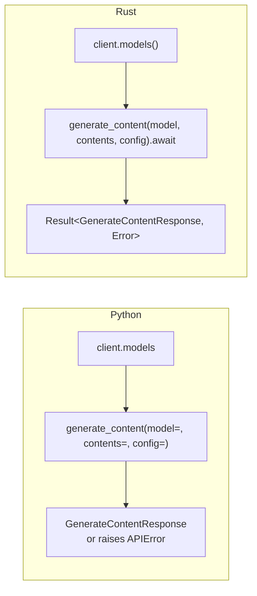

# Migrating from the `google-genai` Python SDK

Japanese version: [migrating-from-python.ja.md](migrating-from-python.ja.md)

## Table of Contents

- [Overview](#overview)
- [Client construction](#client-construction)
- [Sync vs async](#sync-vs-async)
- [Passing `contents`](#passing-contents)
- [Config: structs instead of kwargs](#config-structs-instead-of-kwargs)
- [Error handling](#error-handling)
- [Streaming](#streaming)
- [Paging](#paging)
- [Automatic function calling](#automatic-function-calling)
- [MCP tools](#mcp-tools)
- [Live sessions](#live-sessions)
- [Known divergences from the Python SDK](#known-divergences-from-the-python-sdk)
- [Full mapping](#full-mapping)

## Overview

`gemini_genai` keeps the Python SDK's *shape* and changes only what Rust forces
it to. The mental translation is mostly mechanical:

| Python | Rust |
|---|---|
| `client.models.generate_content(...)` | `client.models().generate_content(...).await` |
| `model=`, `contents=`, `config=` keyword args | positional `(model, contents, config)`, in that order |
| `config=types.XConfig(a=1)` or `config={"a": 1}` | `Some(XConfig { a: Some(1), ..Default::default() })` |
| `config=None` (omitted) | `None` |
| exceptions (`APIError`, `ValueError`) | `Result<T, gemini_genai::Error>` |
| generators (`for chunk in ...`) | `Stream<Item = Result<T>>` |
| `Pager` / `AsyncPager` | `Pager<T>` |
| `client.aio.*` (async) | the default API — everything is `async fn` |
| `client.*` (sync) | `gemini_genai::blocking::*` (feature `blocking`) |



The one hard scope difference: **this crate implements the Gemini Developer API
only.** Vertex AI is not ported. Vertex-only *types* still exist (they are
generated wholesale), but Vertex-only *fields* are rejected at request time with
`Error::UnsupportedByBackend`, and asking for the Vertex backend at all fails with
`Error::UnsupportedBackend`.

## Client construction

```python
from google import genai

client = genai.Client()                       # GOOGLE_API_KEY / GEMINI_API_KEY
client = genai.Client(api_key="...")
client = genai.Client(http_options=types.HttpOptions(timeout=30_000))
```

```rust,no_run
use gemini_genai::Client;
use gemini_genai::types::HttpOptions;

# fn main() -> gemini_genai::Result<()> {
let client = Client::new()?;                       // GOOGLE_API_KEY / GEMINI_API_KEY

let client = Client::builder().api_key("...").build()?;

let client = Client::builder()
    .http_options(HttpOptions { timeout: Some(30_000), ..Default::default() })
    .build()?;
# Ok(())
# }
```

Environment resolution matches Python's precedence: `GOOGLE_API_KEY` first,
`GEMINI_API_KEY` as the fallback, a warning logged (via `tracing`) when both are
set. `GOOGLE_GEMINI_BASE_URL` overrides the base URL unless the builder already
supplied one.

`Client` is `Clone` and internally `Arc`-backed, so cloning it into tasks is cheap
— there is no need for a global singleton or a connection pool of your own.

Vertex AI knobs exist on the builder for signature parity but are not implemented:

```rust,no_run
# use gemini_genai::{Client, Error};
let result = Client::builder().vertexai(true).build();
assert!(matches!(result, Err(Error::UnsupportedBackend("vertexai"))));
```

`GOOGLE_GENAI_USE_VERTEXAI=1` in the environment has the same effect, as does
setting `project` or `location`.

## Sync vs async

Python's SDK is synchronous by default with `client.aio` for async. This crate
inverts that: **async is the default**, and the synchronous mirror lives behind
the `blocking` feature.

```toml
gemini-genai = { version = "0.1", features = ["blocking"] }
```

```rust,no_run
use gemini_genai::blocking::Client;

# fn main() -> gemini_genai::Result<()> {
let client = Client::new()?;
let response = client
    .models()
    .generate_content("gemini-flash-latest", "Hello", None)?;   // no .await
# let _ = response;
# Ok(())
# }
```

`blocking::Client` provides the same module accessors (`models()`, `chats()`,
`files()`, `caches()`, `tunings()`, `batches()`, `operations()`,
`file_search_stores()`, `auth_tokens()`) with the same method names and argument
order, minus `live()` — the Live API is async-only in Python too.

Two things to know:

- Each `blocking::Client` owns a dedicated **current-thread** Tokio runtime. No
  extra OS threads; every call runs the async graph to completion on the calling
  thread.
- Calling a blocking method — *or even constructing a `blocking::Client`* — from
  inside a running Tokio runtime returns `Error::BlockingInsideRuntime` instead of
  panicking. Construction is guarded too because a `tokio::runtime::Runtime`
  cannot be dropped inside an async context either, which would otherwise turn
  into a mystery panic at some unrelated `drop` site later. So this is an error,
  not a deadlock:

  ```rust,no_run
  # use gemini_genai::Error;
  #[tokio::main]
  async fn main() {
      let result = gemini_genai::blocking::Client::new();
      assert!(matches!(result, Err(Error::BlockingInsideRuntime)));
  }
  ```

Streams become `Iterator<Item = Result<T>>` (`blocking::BlockingStream<T>`), and
pagers become `blocking::Pager<T>`. Both hold the same runtime handle as the
client, so they keep working after that client is dropped.

## Passing `contents`

Python coerces `str | Part | Content | list[...] | PIL.Image | dict` at runtime.
Rust does the same coercion at compile time through `From` impls on
`types::Contents`; every method that takes content accepts `impl Into<Contents>`.

| Python | Rust |
|---|---|
| `contents="hello"` | `"hello"` (`&str`) or a `String` |
| `contents=types.Part.from_text(text="hi")` | `Part::from_text("hi")` |
| `contents=[part_a, part_b]` | `vec![part_a, part_b]` (`Vec<Part>`) |
| `contents=types.Content(role="user", parts=[...])` | `Content { role: Some("user".into()), parts: Some(vec![...]) }` |
| `contents=[content_a, content_b]` | `Vec<Content>` |

That is the complete list of `From` impls — `&str`, `String`, `Part`,
`Vec<Part>`, `Content`, `Vec<Content>`. There is no `PIL.Image` equivalent; use
`Part::from_bytes` (or `Part::from_file_bytes`, which reads a path and guesses the
MIME type from the extension).

A bare `Vec<Part>` is collapsed into a single `Content`, with the role inferred:
`model` if any part carries a `function_call`, otherwise `user` — the same rule
Python applies.

`Part` constructors mirror Python's classmethods one for one:

| Python | Rust |
|---|---|
| `Part.from_text(text=)` | `Part::from_text(text)` |
| `Part.from_bytes(data=, mime_type=)` | `Part::from_bytes(data, mime_type)` |
| `Part.from_uri(file_uri=, mime_type=)` | `Part::from_uri(uri, mime_type)` |
| `Part.from_function_call(name=, args=)` | `Part::from_function_call(name, args)` |
| `Part.from_function_response(name=, response=)` | `Part::from_function_response(name, response)` |
| — (read the file yourself, then `from_bytes`) | `Part::from_file_bytes(path)?` (extra convenience) |

## Config: structs instead of kwargs

Python's config objects are pydantic models built from keyword arguments, with
everything optional. Rust uses plain structs where every field is `Option<T>`, so
the idiom is a struct literal finished with `..Default::default()`:

```python
config = types.GenerateContentConfig(
    temperature=0.2,
    max_output_tokens=512,
    system_instruction="Be terse.",
)
```

```rust
use gemini_genai::types::{Content, GenerateContentConfig};

let config = GenerateContentConfig {
    temperature: Some(0.2),
    max_output_tokens: Some(512),
    system_instruction: Some(Content::from("Be terse.")),
    ..Default::default()
};
```

Three habits worth forming:

1. **Always end with `..Default::default()`.** Generated types are deliberately
   *not* `#[non_exhaustive]` so you can build them with struct literals, but new
   fields do get added as the upstream SDK grows.
2. **Wrap scalars in `Some`.** A missing field is `None`, not a sentinel.
3. **The whole config is optional too**, hence `Option<XConfig>` — pass `None`
   where Python would omit `config=`.

Structured output has a dedicated shortcut. Python passes a pydantic model as
`response_schema=`; Rust derives the schema from any `schemars::JsonSchema` type:

```rust
use gemini_genai::types::GenerateContentConfig;

#[derive(serde::Deserialize, schemars::JsonSchema)]
struct Capital {
    country: String,
    capital: String,
}

// Sets `response_json_schema` and defaults `response_mime_type` to
// "application/json".
let config = GenerateContentConfig::default().with_json_schema_of::<Capital>();
```

Building a `types::Schema` by hand and setting `response_schema` also works, when
you want byte-exact control of the wire schema.

Enums generated from the Python SDK carry an `Unknown(String)` variant, so a value
the server adds later deserializes instead of failing — but it also means `match`
on them is never exhaustive without a catch-all arm.

## Error handling

Python raises; Rust returns. Replace `try`/`except` with `match` (or `?` when you
just want to propagate).

```python
try:
    response = client.models.generate_content(...)
except errors.ClientError as e:
    if e.code == 429:
        ...
except errors.ServerError:
    ...
```

```rust
use gemini_genai::Error;

fn classify(error: &Error) -> &'static str {
    match error {
        Error::Api(api) if api.code == 429 => "rate limited",
        Error::Api(api) if api.is_client_error() => "bad request",
        Error::Api(api) if api.is_server_error() => "server error, retry",
        Error::Http(_) => "transport failure",
        Error::Validation(_) => "rejected before sending",
        Error::UnsupportedByBackend { .. } => "Vertex-only field on a Gemini client",
        _ => "other",
    }
}
```

Mapping from Python's exception hierarchy:

| Python | Rust |
|---|---|
| `APIError` / `ClientError` / `ServerError` | `Error::Api(Box<ApiError>)` — use `code`, `is_client_error()`, `is_server_error()` to discriminate |
| `UnknownApiResponseError` | `Error::Json` |
| `ValueError` (client-side validation) | `Error::Validation(String)` |
| `ValueError("... only supported in Vertex AI")` | `Error::UnsupportedByBackend { field, backend }` |
| `UnsupportedFunctionError` / `UnknownFunctionCallArgumentError` / `FunctionInvocationError` | `Error::FunctionCall(FunctionCallError::…)` |
| `IndexError` from `pager.next_page()` | `Error::NoMorePages` |
| network/timeout exceptions from `httpx` | `Error::Http(reqwest::Error)` |
| — | `Error::Stream`, `Error::Upload`, `Error::UnsupportedBackend`, `Error::BlockingInsideRuntime`, `Error::Io` |

`ApiError` keeps `code`, `status`, `message`, `details`, and `response_headers`,
so nothing Python exposed is lost.

## Streaming

Python's `generate_content_stream` returns a generator. Rust returns a
`Result<GenerateContentStream>` — the outer `Result` covers the failure to *start*
the request, and each item is a `Result` covering mid-stream failures.

```python
for chunk in client.models.generate_content_stream(model=..., contents=...):
    print(chunk.text, end="")
```

```rust,no_run
# async fn run(client: gemini_genai::Client) -> gemini_genai::Result<()> {
use futures_util::StreamExt;   // brings `.next()` into scope

let stream = client
    .models()
    .generate_content_stream("gemini-flash-latest", "Hello", None)
    .await?;

let mut stream = Box::pin(stream);
while let Some(chunk) = stream.next().await {
    print!("{}", chunk?.text().unwrap_or_default());
}
# Ok(())
# }
```

`futures_util::StreamExt` is the import people forget; without it there is no
`.next()`. `Box::pin` (or `tokio::pin!`) is needed because `next()` requires
`Unpin`.

A mid-stream error yields exactly one `Err` item and then the stream ends — it
does not keep producing errors.

`Chat::send_message_stream` behaves the same way, with one extra rule: the
returned `ChatStream` borrows the `Chat` mutably and only writes the model's turn
into history once it has been **fully drained**. Abandoning it half-way leaves that
turn unrecorded.

## Paging

```python
pager = client.models.list()
print(pager.page_size, len(pager.page))
pager.next_page()          # raises IndexError when exhausted

for model in client.models.list():   # iterate everything
    ...
```

```rust,no_run
# async fn run(client: gemini_genai::Client) -> gemini_genai::Result<()> {
use futures_util::StreamExt;

let mut pager = client.models().list(None).await?;
println!("{} items on this page", pager.page().len());

// One page at a time; `Error::NoMorePages` once exhausted.
match pager.next_page().await {
    Ok(items) => println!("{} more", items.len()),
    Err(gemini_genai::Error::NoMorePages) => println!("done"),
    Err(other) => return Err(other),
}

// Or: every item across every page, fetched lazily.
let pager = client.models().list(None).await?;
let mut items = Box::pin(pager.into_stream());
while let Some(model) = items.next().await {
    println!("{:?}", model?.name);
}
# Ok(())
# }
```

`Pager<T>` exposes `name()`, `page()`, `page_size()`, `config()`,
`next_page().await`, and `into_stream()` — the same surface as Python's `Pager`,
plus the stream adaptor in place of `__iter__`.

## Automatic function calling

Python passes bare callables in `config.tools` and introspects their signature and
docstring. Rust has no runtime introspection, so the schema comes from a
`schemars::JsonSchema` argument type and the description is passed explicitly:

```python
def get_weather(city: str) -> dict:
    """Returns the current weather for a city."""
    ...

config = types.GenerateContentConfig(tools=[get_weather])
```

```rust,no_run
use gemini_genai::afc::function_tool;
use gemini_genai::types::{GenerateContentConfig, Tool};

#[derive(serde::Deserialize, schemars::JsonSchema)]
struct WeatherArgs {
    /// The city to look up.      <- doc comments become schema descriptions
    city: String,
}

let tool = Tool::from_function(function_tool(
    "get_weather",
    "Returns the current weather for a city.",
    |args: WeatherArgs| async move {
        Ok(serde_json::json!({ "city": args.city, "temperature_c": 21 }))
    },
));

let config = GenerateContentConfig { tools: Some(vec![tool]), ..Default::default() };
```

`models().generate_content` then drives the call loop itself and returns the final
answer, with the intermediate turns in
`response.automatic_function_calling_history`. `AutomaticFunctionCallingConfig`
works exactly as in Python:

```rust
use gemini_genai::types::{AutomaticFunctionCallingConfig, GenerateContentConfig};

let config = GenerateContentConfig {
    automatic_function_calling: Some(AutomaticFunctionCallingConfig {
        maximum_remote_calls: Some(5),   // default 10
        // `disable: Some(true)` turns the loop off entirely;
        // `ignore_call_history: Some(true)` omits the intermediate turns
        // from the response.
        ..Default::default()
    }),
    ..Default::default()
};
```

### The registry caveat

This is the one place where the Rust port behaves differently from Python, and it
is worth understanding rather than discovering.

`Tool` is a generated, plain-data struct that goes on the wire verbatim; it has
nowhere to store an `Arc<dyn FunctionTool>`. And `generate_content`'s signature —
fixed to mirror Python's — has no side channel for a per-call function map. So
`Tool::from_function` stores the callable in a **process-wide registry keyed by the
declared function name**, and the AFC loop looks it up by the name the model echoes
back.

Consequence: registering two *different* callables under the same function name
means the most recent registration wins for **both**. Python rebuilds its
`function_map` from each call's own `config.tools`, so it never leaks across calls.

In practice this is easy to live with — give each callable a distinct name, and
register tools once at startup rather than per request. But if you generate tools
dynamically per user/session, make the names unique.

## MCP tools

With the `mcp` feature, `mcp_tools` wraps every tool exposed by an MCP server
(reached through an `rmcp` client `Peer`) as an AFC tool:

```rust,ignore
let tools = gemini_genai::mcp::mcp_tools(&peer).await?;
let config = GenerateContentConfig { tools: Some(tools), ..Default::default() };
```

Same registry caveat applies — MCP tool names share the namespace with your own.

## Live sessions

Python uses an async context manager; Rust returns an owned session you close
explicitly.

```python
async with client.aio.live.connect(model=..., config=...) as session:
    await session.send_client_content(turns=..., turn_complete=True)
    async for message in session.receive():
        ...
```

```rust,no_run
# async fn run(client: gemini_genai::Client) -> gemini_genai::Result<()> {
use futures_util::StreamExt;
use gemini_genai::types::Content;

let mut session = client.live().connect("gemini-3.1-flash-live-preview", None).await?;

session
    .send_client_content(Some(vec![Content::from("Hello!")]), true)
    .await?;

{
    let mut messages = Box::pin(session.receive());
    while let Some(message) = messages.next().await {
        let message = message?;
        if message.server_content.as_ref().and_then(|c| c.turn_complete) == Some(true) {
            break;
        }
    }
}
session.close().await?;
# Ok(())
# }
```

`connect` completes the `setup`/`setupComplete` handshake before returning, so the
session is usable immediately; `setup_complete()` exposes the server's reply.
`receive()` borrows the session mutably, so the borrow has to end (a scope, or
`drop`) before `close()` takes ownership.

`send_realtime_input` takes a `RealtimeInput` struct with one field set per call
instead of Python's mutually exclusive keyword arguments.
`client.live().music()` covers realtime music generation
(`set_weighted_prompts` / `set_music_generation_config` / `play` / `pause` /
`stop` / `reset_context` / `receive` / `close`).

Python's deprecated `AsyncSession.send` and `start_stream` are not ported.

## Known divergences from the Python SDK

Beyond "async by default" and the AFC registry, these are the deliberate
differences worth knowing when porting code:

| Area | Python | Rust | Why |
|---|---|---|---|
| Vertex AI backend | supported | `Error::UnsupportedBackend` | out of scope for 0.2.0 |
| `models.compute_tokens` | Vertex-only | present, always `Error::UnsupportedBackend("models.compute_tokens")` | the Gemini Developer API has no such endpoint |
| `tunings.list` | Vertex-only | present, always `Error::UnsupportedByBackend` | upstream has no `_to_mldev` converter for it, so there is no faithful request to send |
| `edit_image` / `upscale_image` / `recontext_image` / `segment_image` | Vertex-only | not implemented | same reason |
| `models.generate_videos(prompt=, image=, video=, source=)` | four optional kwargs | one `GenerateVideosSource` argument | Rust has no keyword arguments |
| `files.upload(file=str \| Path \| IO)` | any of the three | `impl Into<UploadSource>`: `Path`/`&str`/`String` (read fully into memory) or `Bytes { data, mime_type }` | no `IOBase` equivalent; streaming-from-disk is a possible follow-up |
| `files.download(file=File \| str)` | either | `&str` (bare id, `files/...` name, or full download URI) | — |
| `Chat.record_history` | public | private (`send_message` maintains history for you) | history bookkeeping is an internal invariant here |
| `client.http_options` | readable attribute | not exposed | keep the accessor set minimal for 0.2.0 |
| generated enums | strict | extra `Unknown(String)` variant | forward compatibility with server-added values |
| `local_tokenizer` | available | not ported | needs a sentencepiece binding |
| `interactions` / `agents` / `webhooks` / `triggers` / `environments` | preview NextGen SDK | not ported | separate, independently generated SDK upstream |
| replay / `DebugConfig` | available | not ported | this crate tests with golden JSON fixtures plus `wiremock` |

## Full mapping

[`docs/parity.md`](parity.md) is generated from the same source of truth as the
code and lists every Python method and type against its Rust counterpart,
including everything marked as not ported.
