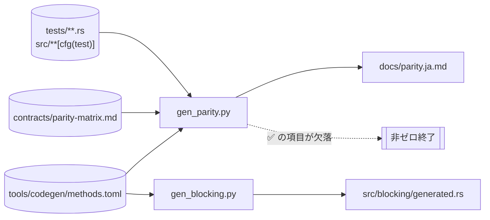

<!-- @generated by tools/codegen/gen_parity.py from tools/codegen/methods.toml
     and specs/001-port-genai-rust/contracts/parity-matrix.md. DO NOT EDIT.

     SPDX-FileCopyrightText: 2025 Google LLC
     SPDX-FileCopyrightText: 2026 Daisuke ITO
     SPDX-License-Identifier: Apache-2.0

     Derived from the Google Gen AI Python SDK (google-genai 2.19.0),
     https://github.com/googleapis/python-genai
     Copyright 2025 Google LLC, licensed under the Apache License, Version 2.0.

     Modified: the method inventory is mechanically derived from the upstream
     SDK's public API surface.

     See the NOTICE file at the repository root for the full attribution.

     Edit tools/codegen/gen_parity.py (or tools/codegen/methods.toml) and re-run
     `python tools/codegen/generate.py --only parity` instead. -->

# Python → Rust 対応表

**基準**: google-genai 2.19.0 | **クレート**: `gemini-genai`（`gemini_genai`） | **真実の源**: `specs/001-port-genai-rust/contracts/parity-matrix.md`

English version: [parity.md](parity.md)

## 目次

- [概要](#概要)
- [この文書の生成方法](#この文書の生成方法)
- [凡例](#凡例)
- [モジュール別サマリ](#モジュール別サマリ)
- [メソッド対応](#メソッド対応)
  - [models](#models)
  - [chats](#chats)
  - [files](#files)
  - [caches](#caches)
  - [tunings](#tunings)
  - [batches](#batches)
  - [operations](#operations)
  - [file_search_stores](#file_search_stores)
  - [documents](#documents)
  - [auth_tokens](#auth_tokens)
  - [live](#live)
  - [live_music](#live_music)
- [クライアント生成](#クライアント生成)
- [型](#型)
- [対象外（理由付き）](#対象外理由付き)

## 概要

google-genai 2.19.0（Python）が Gemini Developer API 向けに公開している **71** 個の公開メソッド（＋ Rust 固有のアクセサ）のカバレッジ。**64** 個が実装済み、**2** 個は Vertex AI 専用のため `UnsupportedByBackend` を返すスタブ、**5** 個は Vertex AI 専用で移植していない。うち **66** 個についてはテスト関数を自動検出できた。

この表は `tools/codegen/methods.toml`（メソッド台帳）と `specs/001-port-genai-rust/contracts/parity-matrix.md`（合意済みの真実の源）から生成している。対応表が ✅ と記した項目が台帳から欠けていれば `gen_parity.py` は非ゼロ終了し、CI の `codegen-check` が落ちる。

## この文書の生成方法

## 凡例

| ステータス | 意味 |
|---|---|
| ✅ 実装済み | 対応する Rust メソッドが存在し、テストで担保されている |
| ⚠️ `UnsupportedByBackend` | Python 側で Vertex AI 専用。シグネチャのみ移植してあり、呼ぶと必ずエラーを返す |
| ⏭ 未移植（Vertex AI 専用） | `vertexai=False` のとき Python 側が `ValueError` を送出するため対象外 |

「テスト」列は、`tests/**.rs` と `src/**` の `#[cfg(test)]` モジュールを走査し、`.<module>().<method>(` のチェーン呼び出しを含むテスト関数を拾ったもの（モジュール自身の `#[cfg(test)]` 内では素の `.<method>(` 呼び出し、どちらにも当たらなければアクセサ呼び出し＋メソッド名）。**カバレッジの証明ではなくヒューリスティックとして扱うこと。** 1 メソッドあたり最大 3 件まで表示する。

## モジュール別サマリ

| モジュール | メソッド数 | 実装済み | `UnsupportedByBackend` | 未移植 | テスト検出数 |
|---|---:|---:|---:|---:|---:|
| [models](#models) | 15 | 10 | 1 | 4 | 11 |
| [chats](#chats) | 5 | 5 | 0 | 0 | 5 |
| [files](#files) | 6 | 6 | 0 | 0 | 6 |
| [caches](#caches) | 5 | 5 | 0 | 0 | 5 |
| [tunings](#tunings) | 5 | 3 | 1 | 1 | 4 |
| [batches](#batches) | 6 | 6 | 0 | 0 | 6 |
| [operations](#operations) | 1 | 1 | 0 | 0 | 1 |
| [file_search_stores](#file_search_stores) | 8 | 8 | 0 | 0 | 8 |
| [documents](#documents) | 3 | 3 | 0 | 0 | 3 |
| [auth_tokens](#auth_tokens) | 1 | 1 | 0 | 0 | 1 |
| [live](#live) | 6 | 6 | 0 | 0 | 6 |
| [live_music](#live_music) | 10 | 10 | 0 | 0 | 10 |
| **合計** | **71** | **64** | **2** | **5** | **66** |

## メソッド対応

### models

| Python | Rust | ステータス | テスト |
|---|---|---|---|
| `models.generate_content` | `models::Models::generate_content` | ✅ 実装済み | `src/models.rs::generate_content_deserializes_unknown_response_fields_without_failing` `src/models.rs::generate_content_maps_a_client_error_to_api_error` `src/models.rs::generate_content_posts_to_the_model_generate_content_path` ほか 29 件 |
| `models.generate_content_stream` | `models::Models::generate_content_stream` | ✅ 実装済み | `src/models.rs::generate_content_stream_yields_chunks_in_order` `tests/blocking_parity.rs::generate_content_stream_yields_chunks_via_iterator` `tests/e2e.rs::test_e2e_generate_content_stream` |
| `models.embed_content` | `models::Models::embed_content` | ✅ 実装済み | `src/models.rs::embed_content_posts_to_batch_embed_contents` `tests/e2e.rs::test_e2e_embed_content` |
| `models.count_tokens` | `models::Models::count_tokens` | ✅ 実装済み | `src/models.rs::count_tokens_posts_and_parses_total` `tests/e2e.rs::test_e2e_count_tokens` |
| `models.compute_tokens` | `models::Models::compute_tokens` | ⚠️ `UnsupportedByBackend`（Vertex AI 専用） | `src/models.rs::compute_tokens_is_unsupported_on_the_gemini_api_backend` |
| `models.get` | `models::Models::get` | ✅ 実装済み | `src/models.rs::get_fetches_a_model_by_resource_name` |
| `models.list` | `models::Models::list` | ✅ 実装済み | `src/models.rs::list_defaults_query_base_to_true_and_pages` `src/models.rs::list_uses_tuned_models_collection_when_query_base_is_false` `tests/blocking_parity.rs::list_paginates_via_the_blocking_pager` ほか 2 件 |
| `models.update` | `models::Models::update` | ✅ 実装済み | `src/models.rs::update_patches_a_tuned_model` |
| `models.delete` | `models::Models::delete` | ✅ 実装済み | `src/models.rs::delete_removes_a_tuned_model` `tests/e2e_expensive.rs::test_e2e_tuning_create_get_and_delete_tuned_model` |
| `models.generate_images` | `models::Models::generate_images` | ✅ 実装済み（`#[deprecated]`） | `src/models.rs::generate_images_posts_prompt_to_predict` `src/models.rs::generate_images_rejects_every_vertex_only_config_field` |
| `models.generate_videos` | `models::Models::generate_videos` | ✅ 実装済み | `src/models.rs::generate_videos_posts_to_predict_long_running_and_parses_operation` `tests/e2e_expensive.rs::test_e2e_generate_videos_and_poll_operation` `tests/operations.rs::generate_videos_then_operations_get_returns_the_completed_operation` |
| `models.edit_image` | — | ⏭ 未移植（Vertex AI 専用） | — |
| `models.recontext_image` | — | ⏭ 未移植（Vertex AI 専用） | — |
| `models.segment_image` | — | ⏭ 未移植（Vertex AI 専用） | — |
| `models.upscale_image` | — | ⏭ 未移植（Vertex AI 専用） | — |

### chats

| Python | Rust | ステータス | テスト |
|---|---|---|---|
| `chats.create` | `chats::Chats::create` | ✅ 実装済み（同期版は手書き） | `tests/chats.rs::create_with_history_seeds_the_chat_before_any_send` `src/chats.rs::send_message_excludes_an_invalid_response_from_curated_history_only` `src/chats.rs::send_message_records_both_turns_and_replays_curated_history` ほか 7 件 |
| `chats.Chat.send_message` | `chats::Chat::send_message` | ✅ 実装済み（同期版は手書き） | `src/chats.rs::send_message_excludes_an_invalid_response_from_curated_history_only` `src/chats.rs::send_message_records_both_turns_and_replays_curated_history` `src/chats.rs::send_message_with_afc_records_only_the_final_turn` |
| `chats.Chat.send_message_stream` | `chats::Chat::send_message_stream` | ✅ 実装済み（同期版は手書き） | `tests/blocking_parity.rs::chat_send_message_and_send_message_stream_record_history` `tests/chats.rs::streaming_send_records_the_accumulated_model_reply_once_drained` |
| `chats.Chat.get_history` | `chats::Chat::get_history` | ✅ 実装済み（同期版は手書き） | `src/chats.rs::send_message_excludes_an_invalid_response_from_curated_history_only` `src/chats.rs::send_message_records_both_turns_and_replays_curated_history` `src/chats.rs::send_message_with_afc_records_only_the_final_turn` |
| `chats.Chat.record_history` | `chats::Chat::record_history` | ✅ 実装済み（非公開ヘルパー、同期版は手書き） | `tests/blocking_parity.rs::chat_send_message_and_send_message_stream_record_history` |

### files

| Python | Rust | ステータス | テスト |
|---|---|---|---|
| `files.upload` | `files::Files::upload` | ✅ 実装済み | `src/files.rs::upload_bytes_source_does_not_touch_the_filesystem` `tests/files.rs::upload_a_nine_mebibyte_payload_sends_exactly_two_chunks` `tests/files.rs::upload_bytes_source_never_touches_the_filesystem` ほか 3 件 |
| `files.get` | `files::Files::get` | ✅ 実装済み | `src/files.rs::get_requests_the_files_name_path` `tests/files.rs::get_returns_the_files_metadata` `tests/e2e.rs::test_e2e_files_upload_get_delete` |
| `files.list` | `files::Files::list` | ✅ 実装済み | `tests/files.rs::list_returns_a_pager_that_fetches_the_next_page` |
| `files.delete` | `files::Files::delete` | ✅ 実装済み | `tests/files.rs::delete_sends_a_delete_request_to_the_files_name_path` `tests/e2e.rs::test_e2e_files_upload_get_delete` |
| `files.download` | `files::Files::download` | ✅ 実装済み | `tests/files.rs::download_requests_alt_media_and_returns_raw_bytes` |
| `files._register_files` | `files::Files::register_files` | ✅ 実装済み | `tests/files.rs::register_files_posts_the_uris_and_parses_the_returned_files` |

### caches

| Python | Rust | ステータス | テスト |
|---|---|---|---|
| `caches.create` | `caches::Caches::create` | ✅ 実装済み | `src/caches.rs::create_posts_to_cached_contents_with_the_flattened_config_body` `src/caches.rs::create_sends_ttl_and_contents_in_the_request_body` `tests/caches.rs::create_posts_the_flattened_config_body_to_cached_contents` ほか 2 件 |
| `caches.get` | `caches::Caches::get` | ✅ 実装済み | `src/caches.rs::get_fetches_by_normalized_resource_name` `tests/caches.rs::get_fetches_by_normalized_resource_name` `tests/caches.rs::get_maps_a_client_error_to_api_error` ほか 1 件 |
| `caches.list` | `caches::Caches::list` | ✅ 実装済み | `src/caches.rs::list_returns_a_pager_that_fetches_subsequent_pages` `src/caches.rs::list_sends_page_size_as_a_query_parameter` `tests/caches.rs::list_returns_a_pager_that_fetches_subsequent_pages` ほか 1 件 |
| `caches.update` | `caches::Caches::update` | ✅ 実装済み | `src/caches.rs::update_patches_by_name_with_the_ttl_body` `tests/caches.rs::update_patches_by_name_with_the_ttl_body` `tests/e2e.rs::test_e2e_cached_content_update_and_delete` |
| `caches.delete` | `caches::Caches::delete` | ✅ 実装済み | `src/caches.rs::delete_maps_a_client_error_to_api_error` `src/caches.rs::delete_removes_by_name_and_deserializes_the_empty_response` `tests/caches.rs::delete_deserializes_the_sdk_http_response_alias` ほか 3 件 |

### tunings

| Python | Rust | ステータス | テスト |
|---|---|---|---|
| `tunings.tune` | `tunings::Tunings::tune` | ✅ 実装済み | `src/tunings.rs::tune_falls_back_to_the_operation_name_when_metadata_has_no_tuned_model` `src/tunings.rs::tune_posts_to_tuned_models_and_synthesizes_a_queued_job` `src/tunings.rs::tune_rejects_a_vertex_only_config_field` ほか 4 件 |
| `tunings.get` | `tunings::Tunings::get` | ✅ 実装済み | `src/tunings.rs::get_fetches_the_job_by_name` `src/tunings.rs::get_maps_a_client_error_to_api_error` `tests/tunings.rs::get_fetches_a_tuning_job_by_resource_name` ほか 1 件 |
| `tunings.list` | `tunings::Tunings::list` | ⚠️ `UnsupportedByBackend`（Vertex AI 専用） | `src/tunings.rs::list_is_unsupported_by_the_gemini_developer_api_backend` `tests/tunings.rs::list_is_unsupported_by_the_gemini_developer_api_backend` |
| `tunings.cancel` | `tunings::Tunings::cancel` | ✅ 実装済み | `src/tunings.rs::cancel_posts_to_the_cancel_suffix` `tests/tunings.rs::cancel_maps_a_not_found_response_to_an_api_error` `tests/tunings.rs::cancel_posts_to_the_cancel_suffix_and_succeeds_on_an_empty_response` |
| `tunings.validate_reward` | — | ⏭ 未移植（Vertex AI 専用） | — |

### batches

| Python | Rust | ステータス | テスト |
|---|---|---|---|
| `batches.create` | `batches::Batches::create` | ✅ 実装済み | `tests/batches.rs::create_rejects_a_source_with_neither_inlined_requests_nor_file_name` `tests/batches.rs::create_with_a_vertex_only_dest_field_is_rejected` `tests/batches.rs::create_with_file_name_sends_the_file_name_input_config` ほか 2 件 |
| `batches.create_embeddings` | `batches::Batches::create_embeddings` | ✅ 実装済み | `tests/batches.rs::create_embeddings_sends_the_async_batch_embed_content_path` |
| `batches.get` | `batches::Batches::get` | ✅ 実装済み | `tests/batches.rs::get_normalizes_the_batch_state_and_the_resource_name` `tests/batches.rs::get_rejects_a_name_that_is_not_a_batches_resource_name` `tests/e2e_expensive.rs::test_e2e_batch_create_get_cancel` |
| `batches.cancel` | `batches::Batches::cancel` | ✅ 実装済み | `tests/batches.rs::cancel_posts_to_the_cancel_suffixed_path` `tests/e2e_expensive.rs::test_e2e_batch_create_get_cancel` |
| `batches.delete` | `batches::Batches::delete` | ✅ 実装済み | `tests/batches.rs::delete_sends_a_delete_request_and_parses_the_resource_job` |
| `batches.list` | `batches::Batches::list` | ✅ 実装済み | `tests/batches.rs::list_returns_a_pager_over_the_batch_jobs_page` `tests/batches.rs::list_sends_page_size_as_a_query_parameter_and_pages_forward` |

### operations

| Python | Rust | ステータス | テスト |
|---|---|---|---|
| `operations.get` | `operations::Operations::get` | ✅ 実装済み（同期版は手書き） | `src/operations.rs::get_polls_the_operation_by_name_and_returns_the_updated_value` `src/operations.rs::get_rejects_an_operation_without_a_name` `tests/operations.rs::generate_videos_then_operations_get_returns_the_completed_operation` ほか 5 件 |

### file_search_stores

| Python | Rust | ステータス | テスト |
|---|---|---|---|
| `file_search_stores.create` | `file_search_stores::FileSearchStores::create` | ✅ 実装済み | `src/file_search_stores.rs::create_posts_to_file_search_stores` |
| `file_search_stores.get` | `file_search_stores::FileSearchStores::get` | ✅ 実装済み | `src/file_search_stores.rs::get_fetches_by_name` |
| `file_search_stores.delete` | `file_search_stores::FileSearchStores::delete` | ✅ 実装済み | `src/file_search_stores.rs::delete_sends_force_query_param` |
| `file_search_stores.list` | `file_search_stores::FileSearchStores::list` | ✅ 実装済み | `src/file_search_stores.rs::list_paginates_through_two_pages` |
| `file_search_stores.import_file` | `file_search_stores::FileSearchStores::import_file` | ✅ 実装済み | `src/file_search_stores.rs::import_file_posts_to_the_import_file_action` `src/file_search_stores.rs::import_file_with_config_sends_custom_metadata_and_parses_response` `tests/file_search_stores.rs::import_file_returns_a_long_running_operation` |
| `file_search_stores.upload_to_file_search_store` | `file_search_stores::FileSearchStores::upload_to_file_search_store` | ✅ 実装済み | `src/file_search_stores.rs::upload_to_file_search_store_performs_a_resumable_upload` `tests/file_search_stores.rs::upload_to_file_search_store_runs_the_resumable_upload_protocol` |
| `file_search_stores.download_media` | `file_search_stores::FileSearchStores::download_media` | ✅ 実装済み | `src/file_search_stores.rs::download_media_gets_with_alt_media` `src/file_search_stores.rs::download_media_rejects_an_invalid_media_id` `tests/file_search_stores.rs::download_media_returns_raw_bytes` |
| — （Rust 固有のアクセサ） | `file_search_stores::FileSearchStores::documents` | ✅ 実装済み（同期版は手書き） | `tests/file_search_stores.rs::documents_get_list_and_delete` |

### documents

| Python | Rust | ステータス | テスト |
|---|---|---|---|
| `documents.get` | `documents::Documents::get` | ✅ 実装済み | `src/documents.rs::get_fetches_by_name` |
| `documents.delete` | `documents::Documents::delete` | ✅ 実装済み | `src/documents.rs::delete_sends_force_query_param` |
| `documents.list` | `documents::Documents::list` | ✅ 実装済み | `src/documents.rs::list_fetches_documents_under_the_parent_store` |

### auth_tokens

| Python | Rust | ステータス | テスト |
|---|---|---|---|
| `tokens.create` | `auth_tokens::AuthTokens::create` | ✅ 実装済み | `src/auth_tokens.rs::create_posts_uses_and_expire_time` `src/auth_tokens.rs::create_with_live_connect_constraints_locks_the_whole_setup` `tests/auth_tokens.rs::create_posts_uses_expire_time_and_returns_the_token_name` ほか 1 件 |

### live

| Python | Rust | ステータス | テスト |
|---|---|---|---|
| `live.connect` | `live::Live::connect` | ✅ 実装済み（非同期のみ、同期版なし） | `tests/live.rs::connect_rejects_vertex_only_config_field` `tests/live.rs::connect_uses_query_key_and_sends_setup_first` `tests/live.rs::sending_after_the_server_closes_the_connection_fails` ほか 6 件 |
| `live.AsyncSession.send_client_content` | `live::LiveSession::send_client_content` | ✅ 実装済み（非同期のみ、同期版なし） | `tests/live.rs::sending_after_the_server_closes_the_connection_fails` `tests/live.rs::session_sends_client_content_realtime_input_and_tool_response` `tests/e2e_expensive.rs::test_e2e_live_session_audio_turn` |
| `live.AsyncSession.send_realtime_input` | `live::LiveSession::send_realtime_input` | ✅ 実装済み（非同期のみ、同期版なし） | `tests/live.rs::session_sends_client_content_realtime_input_and_tool_response` |
| `live.AsyncSession.send_tool_response` | `live::LiveSession::send_tool_response` | ✅ 実装済み（非同期のみ、同期版なし） | `tests/live.rs::send_tool_response_without_id_is_a_validation_error` `tests/live.rs::session_sends_client_content_realtime_input_and_tool_response` |
| `live.AsyncSession.receive` | `live::LiveSession::receive` | ✅ 実装済み（非同期のみ、同期版なし） | `tests/live.rs::receive_yields_server_messages_in_order_and_ends_on_server_close` `tests/live.rs::sending_after_the_server_closes_the_connection_fails` `tests/e2e_expensive.rs::test_e2e_live_session_audio_turn` |
| `live.AsyncSession.close` | `live::LiveSession::close` | ✅ 実装済み（非同期のみ、同期版なし） | `tests/live.rs::receive_yields_server_messages_in_order_and_ends_on_server_close` `tests/live.rs::sending_after_the_server_closes_the_connection_fails` `tests/live.rs::connect_uses_query_key_and_sends_setup_first` ほか 5 件 |

### live_music

| Python | Rust | ステータス | テスト |
|---|---|---|---|
| `live.music` | `live::Live::music` | ✅ 実装済み（非同期のみ、同期版なし） | `src/live/mod.rs::websocket_endpoint_uses_music_method_verbatim` `tests/live_music.rs::connect_sends_setup_and_waits_for_setup_complete` `tests/live_music.rs::receive_yields_server_messages_and_ends_on_server_close` ほか 1 件 |
| `live.music.connect` | `live::music::LiveMusic::connect` | ✅ 実装済み（非同期のみ、同期版なし） | `tests/live_music.rs::connect_sends_setup_and_waits_for_setup_complete` `tests/live_music.rs::receive_yields_server_messages_and_ends_on_server_close` `tests/live_music.rs::session_sends_weighted_prompts_config_and_playback_control` |
| `live.music.set_weighted_prompts` | `live::music::LiveMusicSession::set_weighted_prompts` | ✅ 実装済み（非同期のみ、同期版なし） | `tests/live_music.rs::session_sends_weighted_prompts_config_and_playback_control` |
| `live.music.set_music_generation_config` | `live::music::LiveMusicSession::set_music_generation_config` | ✅ 実装済み（非同期のみ、同期版なし） | `tests/live_music.rs::session_sends_weighted_prompts_config_and_playback_control` |
| `live.music.play` | `live::music::LiveMusicSession::play` | ✅ 実装済み（非同期のみ、同期版なし） | `tests/live_music.rs::session_sends_weighted_prompts_config_and_playback_control` |
| `live.music.pause` | `live::music::LiveMusicSession::pause` | ✅ 実装済み（非同期のみ、同期版なし） | `tests/live_music.rs::session_sends_weighted_prompts_config_and_playback_control` |
| `live.music.stop` | `live::music::LiveMusicSession::stop` | ✅ 実装済み（非同期のみ、同期版なし） | `tests/live_music.rs::session_sends_weighted_prompts_config_and_playback_control` |
| `live.music.reset_context` | `live::music::LiveMusicSession::reset_context` | ✅ 実装済み（非同期のみ、同期版なし） | `tests/live_music.rs::session_sends_weighted_prompts_config_and_playback_control` |
| `live.music.receive` | `live::music::LiveMusicSession::receive` | ✅ 実装済み（非同期のみ、同期版なし） | `tests/live_music.rs::receive_yields_server_messages_and_ends_on_server_close` |
| `live.music.close` | `live::music::LiveMusicSession::close` | ✅ 実装済み（非同期のみ、同期版なし） | `tests/live_music.rs::receive_yields_server_messages_and_ends_on_server_close` `tests/live_music.rs::connect_sends_setup_and_waits_for_setup_complete` `tests/live_music.rs::session_sends_weighted_prompts_config_and_playback_control` |

## クライアント生成

`Client` の構築とバックエンドの選択は個々のメソッドではないため `methods.toml` の対象外。ここには真実の源にある対応表をそのまま再掲する。

| Python | Rust | ステータス |
|---|---|---|
| `genai.Client(api_key=)` | `Client::builder().api_key().build()` / `Client::new()` | ✅ |
| `Client(vertexai=True, project=, location=, credentials=)` | builder に予約、`build()` で `UnsupportedBackend` | ⏭ 後続（Vertex AI） |
| `Client(http_options=)` | `.http_options(HttpOptions)` | ✅（`httpx_*` / `aiohttp_client` / `client_args` は N/A） |
| `Client(debug_config=)` | — | N/A（replay 機構は移植しない） |
| `client.aio.*` | 非同期が主 API | ✅ |
| `client.*`（同期） | `blocking::Client` | ✅（feature `blocking`） |
| `client.interactions/agents/webhooks/triggers/environments` | — | ⏭ 後続（Speakeasy 生成 NextGen SDK） |
| `genai.local_tokenizer` | — | ⏭ 後続（sentencepiece ネイティブ依存） |

## 型

`tools/codegen/gen_types.py` は `google.genai.types` を **411 個の構造体 / 79 個の enum** に変換する（`src/types/generated/structs.rs`、`src/types/generated/enums.rs`）。型名・フィールド名は Python と 1 対 1（snake_case）で一致するので、ここには列挙しない。

型側の整合性は `gen_types.py` 自身の仕事。マッピング表にないアノテーションに出会った瞬間、クラス名とフィールド名を表示して非ゼロ終了するため、漏れは CI の `codegen-check` で表面化する（`specs/001-port-genai-rust/contracts/codegen.md` の「gen_types.py」を参照）。

## 対象外（理由付き）

| 項目 | 理由 |
|---|---|
| `models.edit_image` | `models.py::_edit_image` は冒頭が `if not self._api_client.vertexai: raise ValueError('This method is only supported in Gemini Enterprise Agent Platform mode, ...')` なので、Gemini Developer API では呼べない。 |
| `models.recontext_image` | `models.py::recontext_image` にも同じ `vertexai` ガードがある。Vertex AI 専用。 |
| `models.segment_image` | `models.py::segment_image` にも同じ `vertexai` ガードがある。Vertex AI 専用。 |
| `models.upscale_image` | `models.py::_upscale_image` にも同じ `vertexai` ガードがある。Vertex AI 専用。 |
| `tunings.validate_reward` | `tunings.py::validate_reward` にも同じ `vertexai` ガードがある。Vertex AI 専用（報酬モデルの検証は Vertex AI のチューニング機能）。 |
| `errors`（真実の源側の行） | `APIError` 系はメソッドではなく型。Rust では `crate::error::Error` enum（`Api` / `Function*` / `UnknownApiResponse` など）として実装しており、`src/error.rs` の `#[cfg(test)]` テストで担保している。 |
| `pagers`（真実の源側の行） | `Pager` / `AsyncPager` はメソッドではなく型。Rust では `crate::pager::Pager<T>`（`page()` / `name()` / `page_size()` / `config()` / `next_page()`）として実装しており、`src/pager.rs` の `#[cfg(test)]` テストと各 `list` メソッドのテストで担保している。 |
| `models.compute_tokens` | ⚠️ stub (always errors)（真実の源に準拠） |
| `models.edit_image` | ⏭ 後続（Vertex AI）（真実の源に準拠） |
| `models.upscale_image` | ⏭ 後続（Vertex AI）（真実の源に準拠） |
| `models.recontext_image` | ⏭ 後続（Vertex AI）（真実の源に準拠） |
| `models.segment_image` | ⏭ 後続（Vertex AI）（真実の源に準拠） |
| `tunings.list` | ⚠️ stub (always errors)（真実の源に準拠） |
| `tunings.validate_reward` | ⏭ 後続（Vertex AI）（真実の源に準拠） |
| `tunings.display_experiment_button` | N/A（IPython 専用）（真実の源に準拠） |
| `tunings.display_model_tuning_button` | N/A（IPython 専用）（真実の源に準拠） |
| `live.AsyncSession.send` | ⏭ 対象外（Deprecated、代替あり）（真実の源に準拠） |
| `live.AsyncSession.start_stream` | ⏭ 対象外（Deprecated、代替あり）（真実の源に準拠） |

バックエンド単位で対象外としているもの（Vertex AI / NextGen / `local_tokenizer` / replay）は、`specs/001-port-genai-rust/contracts/parity-matrix.md` の対象外セクションで扱っている。
