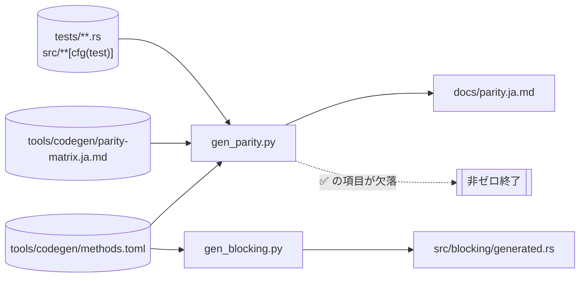

<!-- @generated by tools/codegen/gen_parity.py from tools/codegen/methods.toml
     and tools/codegen/parity-matrix.ja.md. DO NOT EDIT.

     SPDX-FileCopyrightText: 2025 Google LLC
     SPDX-FileCopyrightText: 2026 Daisuke ITO
     SPDX-License-Identifier: Apache-2.0

     Derived from the Google Gen AI Python SDK (google-genai 2.28.0),
     https://github.com/googleapis/python-genai
     Copyright 2025 Google LLC, licensed under the Apache License, Version 2.0.

     Modified: the method inventory is mechanically derived from the upstream
     SDK's public API surface.

     See the NOTICE file at the repository root for the full attribution.

     Edit tools/codegen/gen_parity.py (or tools/codegen/methods.toml) and re-run
     `python tools/codegen/generate.py --only parity` instead. -->

# Python → Rust 対応表

**基準**: google-genai 2.28.0 | **クレート**: `gemini-genai`（`gemini_genai`） | **真実の源**: `tools/codegen/parity-matrix.ja.md`

English version: [parity.md](parity.md)

## 目次

- [概要](#概要)
- [この文書の生成方法](#この文書の生成方法)
- [凡例](#凡例)
- [モジュール別サマリ](#モジュール別サマリ)
- [メソッド対応](#メソッド対応)
  - [models](#models)
  - [chats](#chats)
  - [files](#files)
  - [caches](#caches)
  - [tunings](#tunings)
  - [batches](#batches)
  - [operations](#operations)
  - [file_search_stores](#file_search_stores)
  - [documents](#documents)
  - [auth_tokens](#auth_tokens)
  - [live](#live)
  - [live_music](#live_music)
  - [agents](#agents)
  - [credentials](#credentials)
  - [environments](#environments)
  - [interactions](#interactions)
  - [triggers](#triggers)
  - [voices](#voices)
  - [webhooks](#webhooks)
- [クライアント生成](#クライアント生成)
- [型](#型)
- [対象外（理由付き）](#対象外理由付き)

## 概要

google-genai 2.28.0（Python）が Gemini Developer API 向けに公開している **112** 個の公開メソッド（＋ Rust 固有のアクセサ）のカバレッジ。**104** 個が実装済み、**3** 個は Vertex AI 専用のため `UnsupportedByBackend` を返すスタブ、**5** 個は Vertex AI 専用で移植していない。うち **107** 個についてはテスト関数を自動検出できた。

この表は `tools/codegen/methods.toml`（メソッド台帳）と `tools/codegen/parity-matrix.ja.md`（合意済みの真実の源）から生成している。対応表が ✅ と記した項目が台帳から欠けていれば `gen_parity.py` は非ゼロ終了し、CI の `codegen-check` が落ちる。

## この文書の生成方法

```mermaid
flowchart LR
  M[(tools/codegen/methods.toml)] --> GP[gen_parity.py]
  PM[(tools/codegen/parity-matrix.ja.md)] --> GP
  T[(tests/**.rs<br/>src/**#91;cfg#40;test#41;#93;)] --> GP
  GP --> D[docs/parity.ja.md]
  GP -. ✅ の項目が欠落 .-> X[[非ゼロ終了]]
  M --> GB[gen_blocking.py] --> B[src/blocking/generated.rs]
```

## 凡例

| ステータス | 意味 |
|---|---|
| ✅ 実装済み | 対応する Rust メソッドが存在し、テストで担保されている |
| ⚠️ `UnsupportedByBackend` | Python 側で Vertex AI 専用。シグネチャのみ移植してあり、呼ぶと必ずエラーを返す |
| ⏭ 未移植（Vertex AI 専用） | `vertexai=False` のとき Python 側が `ValueError` を送出するため対象外 |

「テスト」列は、`tests/**.rs` と `src/**` の `#[cfg(test)]` モジュールを走査し、`.<module>().<method>(` のチェーン呼び出しを含むテスト関数を拾ったもの（モジュール自身の `#[cfg(test)]` 内では素の `.<method>(` 呼び出し、どちらにも当たらなければアクセサ呼び出し＋メソッド名）。**カバレッジの証明ではなくヒューリスティックとして扱うこと。** 1 メソッドあたり最大 3 件まで表示する。

## モジュール別サマリ

| モジュール | メソッド数 | 実装済み | `UnsupportedByBackend` | 未移植 | テスト検出数 |
|---|---:|---:|---:|---:|---:|
| [models](#models) | 15 | 9 | 2 | 4 | 11 |
| [chats](#chats) | 5 | 5 | 0 | 0 | 5 |
| [files](#files) | 8 | 8 | 0 | 0 | 8 |
| [caches](#caches) | 5 | 5 | 0 | 0 | 5 |
| [tunings](#tunings) | 5 | 3 | 1 | 1 | 4 |
| [batches](#batches) | 6 | 6 | 0 | 0 | 6 |
| [operations](#operations) | 1 | 1 | 0 | 0 | 1 |
| [file_search_stores](#file_search_stores) | 8 | 8 | 0 | 0 | 8 |
| [documents](#documents) | 3 | 3 | 0 | 0 | 3 |
| [auth_tokens](#auth_tokens) | 1 | 1 | 0 | 0 | 1 |
| [live](#live) | 7 | 7 | 0 | 0 | 7 |
| [live_music](#live_music) | 10 | 10 | 0 | 0 | 10 |
| [agents](#agents) | 4 | 4 | 0 | 0 | 4 |
| [credentials](#credentials) | 5 | 5 | 0 | 0 | 5 |
| [environments](#environments) | 5 | 5 | 0 | 0 | 5 |
| [interactions](#interactions) | 6 | 6 | 0 | 0 | 6 |
| [triggers](#triggers) | 7 | 7 | 0 | 0 | 7 |
| [voices](#voices) | 4 | 4 | 0 | 0 | 4 |
| [webhooks](#webhooks) | 7 | 7 | 0 | 0 | 7 |
| **合計** | **112** | **104** | **3** | **5** | **107** |

## メソッド対応

### models

| Python | Rust | ステータス | テスト |
|---|---|---|---|
| `models.generate_content` | `models::Models::generate_content` | ✅ 実装済み | `src/models.rs::generate_content_deserializes_unknown_response_fields_without_failing` `src/models.rs::generate_content_maps_a_client_error_to_api_error` `src/models.rs::generate_content_posts_to_the_model_generate_content_path` ほか 70 件 |
| `models.generate_content_stream` | `models::Models::generate_content_stream` | ✅ 実装済み | `src/models.rs::generate_content_stream_yields_chunks_in_order` `tests/afc/get_max_remote_calls_for_afc.rs::test_generate_content_stream_spent_budget_does_not_run_functions` `tests/blocking_parity.rs::generate_content_stream_yields_chunks_via_iterator` ほか 12 件 |
| `models.embed_content` | `models::Models::embed_content` | ✅ 実装済み | `src/models.rs::embed_content_posts_to_batch_embed_contents` `tests/e2e.rs::test_e2e_embed_content` `tests/sdk_http_response.rs::models_embed_content_sets_sdk_http_response_headers` ほか 3 件 |
| `models.count_tokens` | `models::Models::count_tokens` | ✅ 実装済み | `src/models.rs::count_tokens_posts_and_parses_total` `tests/e2e.rs::test_e2e_count_tokens` `tests/sdk_http_response.rs::models_count_tokens_sets_sdk_http_response_headers` ほか 3 件 |
| `models.compute_tokens` | `models::Models::compute_tokens` | ⚠️ `UnsupportedByBackend`（Vertex AI 専用） | `src/models.rs::compute_tokens_is_unsupported_on_the_gemini_api_backend` `tests/models/compute_tokens.rs::test_async` |
| `models.get` | `models::Models::get` | ✅ 実装済み | `src/models.rs::get_fetches_a_model_by_resource_name` `tests/models/get.rs::test_async_get_model` `tests/models/get.rs::test_async_get_tuned_model` ほか 1 件 |
| `models.list` | `models::Models::list` | ✅ 実装済み | `src/models.rs::list_defaults_query_base_to_true_and_pages` `src/models.rs::list_uses_tuned_models_collection_when_query_base_is_false` `tests/blocking_parity.rs::list_paginates_via_the_blocking_pager` ほか 5 件 |
| `models.update` | `models::Models::update` | ✅ 実装済み | `src/models.rs::update_patches_a_tuned_model` `tests/models/update.rs::test_async_update_model` |
| `models.delete` | `models::Models::delete` | ✅ 実装済み | `src/models.rs::delete_removes_a_tuned_model` `tests/e2e_expensive.rs::test_e2e_tuning_create_get_and_delete_tuned_model` `tests/models/delete.rs::test_async_delete_model` ほか 3 件 |
| `models.generate_images` | `models::Models::generate_images` | ⚠️ `UnsupportedByBackend`（Vertex AI 専用） | `src/models.rs::generate_images_is_unsupported_by_the_gemini_developer_api_backend` `tests/models/generate_images.rs::test_simple_prompt_async` |
| `models.generate_videos` | `models::Models::generate_videos` | ✅ 実装済み | `src/models.rs::generate_videos_posts_to_predict_long_running_and_parses_operation` `tests/e2e_expensive.rs::test_e2e_generate_videos_and_poll_operation` `tests/operations/main.rs::generate_videos_then_operations_get_returns_the_completed_operation` ほか 1 件 |
| `models.edit_image` | — | ⏭ 未移植（Vertex AI 専用） | — |
| `models.recontext_image` | — | ⏭ 未移植（Vertex AI 専用） | — |
| `models.segment_image` | — | ⏭ 未移植（Vertex AI 専用） | — |
| `models.upscale_image` | — | ⏭ 未移植（Vertex AI 専用） | — |

### chats

| Python | Rust | ステータス | テスト |
|---|---|---|---|
| `chats.create` | `chats::Chats::create` | ✅ 実装済み（同期版は手書き） | `tests/chats/main.rs::create_with_history_seeds_the_chat_before_any_send` `tests/chats/test_get_history.rs::test_async_chat_create` `tests/chats/test_get_history.rs::test_async_chat_create_with_history_dict` ほか 32 件 |
| `chats.Chat.send_message` | `chats::Chat::send_message` | ✅ 実装済み（同期版は手書き） | `src/chats.rs::send_message_excludes_an_invalid_response_from_curated_history_only` `src/chats.rs::send_message_records_both_turns_and_replays_curated_history` `src/chats.rs::send_message_with_afc_records_every_turn` |
| `chats.Chat.send_message_stream` | `chats::Chat::send_message_stream` | ✅ 実装済み（同期版は手書き） | `tests/blocking_parity.rs::chat_send_message_and_send_message_stream_record_history` `tests/shared_chats/test_send_message_stream.rs::test_send_message_stream` `tests/chats/main.rs::streaming_send_records_the_accumulated_model_reply_once_drained` ほか 4 件 |
| `chats.Chat.get_history` | `chats::Chat::get_history` | ✅ 実装済み（同期版は手書き） | `src/chats.rs::send_message_excludes_an_invalid_response_from_curated_history_only` `src/chats.rs::send_message_records_both_turns_and_replays_curated_history` `src/chats.rs::send_message_with_afc_records_every_turn` |
| `chats.Chat.record_history` | `chats::Chat::record_history` | ✅ 実装済み（非公開ヘルパー、同期版は手書き） | `tests/blocking_parity.rs::chat_send_message_and_send_message_stream_record_history` |

### files

| Python | Rust | ステータス | テスト |
|---|---|---|---|
| `files.upload` | `files::Files::upload` | ✅ 実装済み | `src/files.rs::upload_bytes_source_does_not_touch_the_filesystem` `tests/client/upload_errors.rs::test_async_upload_fd_error_httpx` `tests/client/upload_errors.rs::test_async_upload_url_rewrite_httpx` ほか 11 件 |
| `files.get` | `files::Files::get` | ✅ 実装済み | `src/files.rs::get_requests_the_files_name_path` `tests/e2e.rs::test_e2e_files_upload_get_delete` `tests/files/main.rs::get_returns_the_files_metadata` ほか 2 件 |
| `files.list` | `files::Files::list` | ✅ 実装済み | `tests/files/main.rs::list_returns_a_pager_that_fetches_the_next_page` `tests/sdk_http_response.rs::files_list_pager_sets_sdk_http_response_headers` `tests/files/test_list.rs::test_async_pager` ほか 1 件 |
| `files.delete` | `files::Files::delete` | ✅ 実装済み | `tests/e2e.rs::test_e2e_files_upload_get_delete` `tests/files/main.rs::delete_sends_a_delete_request_to_the_files_name_path` `tests/sdk_http_response.rs::files_delete_sets_sdk_http_response_headers` |
| `files.download` | `files::Files::download` | ✅ 実装済み | `tests/files/main.rs::download_requests_alt_media_and_returns_raw_bytes` `tests/files/test_download.rs::test_basic_download` |
| `files.download` | `files::Files::download_stream` | ✅ 実装済み | `tests/files/main.rs::download_stream_accepts_a_downloadable_file_object` `tests/files/main.rs::download_stream_does_not_pre_validate_a_bare_name` `tests/files/main.rs::download_stream_rejects_a_file_with_no_download_uri_before_sending_anything` ほか 5 件 |
| `files.download` | `files::Files::download_to_path` | ✅ 実装済み | `tests/files/main.rs::download_to_path_creates_no_file_when_the_connection_fails_up_front` `tests/files/main.rs::download_to_path_writes_the_same_bytes_the_server_sent` `tests/files/test_download.rs::test_basic_download_async` ほか 3 件 |
| `files._register_files` | `files::Files::register_files` | ✅ 実装済み | `tests/files/main.rs::register_files_posts_the_uris_and_parses_the_returned_files` `tests/files/test_register_table.rs::test_async` |

### caches

| Python | Rust | ステータス | テスト |
|---|---|---|---|
| `caches.create` | `caches::Caches::create` | ✅ 実装済み | `src/caches.rs::create_posts_to_cached_contents_with_the_flattened_config_body` `src/caches.rs::create_sends_ttl_and_contents_in_the_request_body` `tests/caches/create.rs::test_async_googleai_file_create` ほか 5 件 |
| `caches.get` | `caches::Caches::get` | ✅ 実装済み | `src/caches.rs::get_fetches_by_normalized_resource_name` `tests/caches/get.rs::test_async_get` `tests/caches/main.rs::get_fetches_by_normalized_resource_name` ほか 7 件 |
| `caches.list` | `caches::Caches::list` | ✅ 実装済み | `src/caches.rs::list_pager_exposes_the_first_pages_response_headers` `src/caches.rs::list_returns_a_pager_that_fetches_subsequent_pages` `src/caches.rs::list_sends_page_size_as_a_query_parameter` ほか 4 件 |
| `caches.update` | `caches::Caches::update` | ✅ 実装済み | `src/caches.rs::update_patches_by_name_with_the_ttl_body` `tests/caches/main.rs::update_patches_by_name_with_the_ttl_body` `tests/caches/update.rs::test_async_update` ほか 2 件 |
| `caches.delete` | `caches::Caches::delete` | ✅ 実装済み | `src/caches.rs::delete_exposes_the_response_headers_as_sdk_http_response` `src/caches.rs::delete_maps_a_client_error_to_api_error` `src/caches.rs::delete_removes_by_name_and_deserializes_the_empty_response` ほか 6 件 |

### tunings

| Python | Rust | ステータス | テスト |
|---|---|---|---|
| `tunings.tune` | `tunings::Tunings::tune` | ✅ 実装済み | `src/tunings.rs::tune_falls_back_to_the_operation_name_when_metadata_has_no_tuned_model` `src/tunings.rs::tune_posts_to_tuned_models_and_synthesizes_a_queued_job` `src/tunings.rs::tune_rejects_a_vertex_only_config_field` ほか 5 件 |
| `tunings.get` | `tunings::Tunings::get` | ✅ 実装済み | `src/tunings.rs::get_fetches_the_job_by_name` `src/tunings.rs::get_maps_a_client_error_to_api_error` `tests/e2e_expensive.rs::test_e2e_tuning_create_get_and_delete_tuned_model` ほか 3 件 |
| `tunings.list` | `tunings::Tunings::list` | ⚠️ `UnsupportedByBackend`（Vertex AI 専用） | `src/tunings.rs::list_is_unsupported_by_the_gemini_developer_api_backend` `tests/tunings/main.rs::list_is_unsupported_by_the_gemini_developer_api_backend` |
| `tunings.cancel` | `tunings::Tunings::cancel` | ✅ 実装済み | `src/tunings.rs::cancel_posts_to_the_cancel_suffix` `tests/sdk_http_response.rs::tunings_cancel_sets_sdk_http_response_headers` `tests/tunings/main.rs::cancel_maps_a_not_found_response_to_an_api_error` ほか 1 件 |
| `tunings.validate_reward` | — | ⏭ 未移植（Vertex AI 専用） | — |

### batches

| Python | Rust | ステータス | テスト |
|---|---|---|---|
| `batches.create` | `batches::Batches::create` | ✅ 実装済み | `tests/batches/create_with_bigquery.rs::test_async_create` `tests/batches/create_with_file.rs::test_async_create` `tests/batches/create_with_gcs.rs::test_async_create` ほか 8 件 |
| `batches.create_embeddings` | `batches::Batches::create_embeddings` | ✅ 実装済み | `tests/batches/main.rs::create_embeddings_sends_the_async_batch_embed_content_path` `tests/batches/embedding.rs::create_response` `tests/batches/embedding.rs::test_async_from_inline` |
| `batches.get` | `batches::Batches::get` | ✅ 実装済み | `tests/batches/get.rs::test_async_get` `tests/batches/main.rs::get_normalizes_the_batch_state_and_the_resource_name` `tests/batches/main.rs::get_rejects_a_name_that_is_not_a_batches_resource_name` ほか 4 件 |
| `batches.cancel` | `batches::Batches::cancel` | ✅ 実装済み | `tests/batches/cancel.rs::test_async_cancel` `tests/batches/main.rs::cancel_posts_to_the_cancel_suffixed_path` `tests/e2e_expensive.rs::test_e2e_batch_create_get_cancel` ほか 1 件 |
| `batches.delete` | `batches::Batches::delete` | ✅ 実装済み | `tests/batches/delete.rs::test_async_delete` `tests/batches/main.rs::delete_sends_a_delete_request_and_parses_the_resource_job` `tests/sdk_http_response.rs::batches_delete_sets_sdk_http_response_headers` ほか 1 件 |
| `batches.list` | `batches::Batches::list` | ✅ 実装済み | `tests/batches/main.rs::list_returns_a_pager_over_the_batch_jobs_page` `tests/batches/main.rs::list_sends_page_size_as_a_query_parameter_and_pages_forward` `tests/sdk_http_response.rs::batches_list_pager_sets_sdk_http_response_headers` ほか 2 件 |

### operations

| Python | Rust | ステータス | テスト |
|---|---|---|---|
| `operations.get` | `operations::Operations::get` | ✅ 実装済み（同期版は手書き） | `src/operations.rs::get_polls_the_operation_by_name_and_returns_the_updated_value` `src/operations.rs::get_rejects_an_operation_without_a_name` `tests/operations/main.rs::generate_videos_then_operations_get_returns_the_completed_operation` ほか 7 件 |

### file_search_stores

| Python | Rust | ステータス | テスト |
|---|---|---|---|
| `file_search_stores.create` | `file_search_stores::FileSearchStores::create` | ✅ 実装済み | `src/file_search_stores.rs::create_posts_to_file_search_stores` `tests/file_search_stores/test_create.rs::test_async_basic` `tests/file_search_stores/test_create.rs::test_async_display_name` |
| `file_search_stores.get` | `file_search_stores::FileSearchStores::get` | ✅ 実装済み | `src/file_search_stores.rs::get_fetches_by_name` `tests/file_search_stores/test_get.rs::test_async_get` |
| `file_search_stores.delete` | `file_search_stores::FileSearchStores::delete` | ✅ 実装済み | `src/file_search_stores.rs::delete_sends_force_query_param` `tests/file_search_stores/test_delete.rs::test_async_delete` `tests/file_search_stores/test_delete.rs::test_async_force_delete` |
| `file_search_stores.list` | `file_search_stores::FileSearchStores::list` | ✅ 実装済み | `src/file_search_stores.rs::list_paginates_through_two_pages` `tests/sdk_http_response.rs::file_search_stores_list_pager_has_no_sdk_http_response_like_python` `tests/file_search_stores/test_list.rs::test_async_pager` |
| `file_search_stores.import_file` | `file_search_stores::FileSearchStores::import_file` | ✅ 実装済み | `src/file_search_stores.rs::import_file_posts_to_the_import_file_action` `src/file_search_stores.rs::import_file_with_config_sends_custom_metadata_and_parses_response` `tests/file_search_stores/main.rs::import_file_returns_a_long_running_operation` |
| `file_search_stores.upload_to_file_search_store` | `file_search_stores::FileSearchStores::upload_to_file_search_store` | ✅ 実装済み | `src/file_search_stores.rs::upload_to_file_search_store_performs_a_resumable_upload` `tests/file_search_stores/main.rs::upload_to_file_search_store_runs_the_resumable_upload_protocol` |
| `file_search_stores.download_media` | `file_search_stores::FileSearchStores::download_media` | ✅ 実装済み | `src/file_search_stores.rs::download_media_gets_with_alt_media` `src/file_search_stores.rs::download_media_rejects_an_invalid_media_id` `tests/file_search_stores/main.rs::download_media_returns_raw_bytes` |
| — （Rust 固有のアクセサ） | `file_search_stores::FileSearchStores::documents` | ✅ 実装済み（同期版は手書き） | `tests/file_search_stores/main.rs::documents_get_list_and_delete` `tests/sdk_http_response.rs::documents_list_pager_has_no_sdk_http_response_like_python` `tests/documents/test_delete.rs::test_async_delete` ほか 1 件 |

### documents

| Python | Rust | ステータス | テスト |
|---|---|---|---|
| `documents.get` | `documents::Documents::get` | ✅ 実装済み | `src/documents.rs::get_fetches_by_name` `tests/documents/test_get.rs::test_async_get` |
| `documents.delete` | `documents::Documents::delete` | ✅ 実装済み | `src/documents.rs::delete_sends_force_query_param` `tests/documents/test_delete.rs::test_async_delete` |
| `documents.list` | `documents::Documents::list` | ✅ 実装済み | `src/documents.rs::list_fetches_documents_under_the_parent_store` `tests/sdk_http_response.rs::documents_list_pager_has_no_sdk_http_response_like_python` |

### auth_tokens

| Python | Rust | ステータス | テスト |
|---|---|---|---|
| `tokens.create` | `tokens::AuthTokens::create` | ✅ 実装済み | `src/tokens.rs::create_posts_uses_and_expire_time` `src/tokens.rs::create_with_live_connect_constraints_locks_the_whole_setup` `tests/tokens/create.rs::test_async_create_no_lock` ほか 2 件 |

### live

| Python | Rust | ステータス | テスト |
|---|---|---|---|
| `live.connect` | `live::Live::connect` | ✅ 実装済み（非同期のみ、同期版なし） | `tests/live/main.rs::connect_rejects_vertex_only_config_field` `tests/live/main.rs::connect_uses_api_key_header_and_sends_setup_first` `tests/live/main.rs::sending_after_the_server_closes_the_connection_fails` ほか 15 件 |
| `live.AsyncSession.send_client_content` | `live::LiveSession::send_client_content` | ✅ 実装済み（非同期のみ、同期版なし） | `tests/e2e_expensive.rs::test_e2e_live_session_audio_turn` `tests/live/main.rs::sending_after_the_server_closes_the_connection_fails` `tests/live/main.rs::session_sends_client_content_realtime_input_and_tool_response` |
| `live.AsyncSession.send_realtime_input` | `live::LiveSession::send_realtime_input` | ✅ 実装済み（非同期のみ、同期版なし） | `tests/live/main.rs::session_sends_client_content_realtime_input_and_tool_response` |
| `live.AsyncSession.send_tool_response` | `live::LiveSession::send_tool_response` | ✅ 実装済み（非同期のみ、同期版なし） | `tests/live/main.rs::send_tool_response_without_id_is_a_validation_error` `tests/live/main.rs::session_sends_client_content_realtime_input_and_tool_response` |
| `live.AsyncSession.receive` | `live::LiveSession::receive` | ✅ 実装済み（非同期のみ、同期版なし） | `tests/live/main.rs::receive_turn_can_be_called_repeatedly_for_consecutive_turns` `tests/live/main.rs::receive_turn_ends_on_idle_interaction_status_even_without_turn_complete` `tests/live/main.rs::receive_turn_falls_back_to_turn_complete_when_interaction_status_is_absent` ほか 4 件 |
| `live.AsyncSession.receive` | `live::LiveSession::receive_turn` | ✅ 実装済み（非同期のみ、同期版なし） | `tests/live/main.rs::receive_turn_can_be_called_repeatedly_for_consecutive_turns` `tests/live/main.rs::receive_turn_ends_on_idle_interaction_status_even_without_turn_complete` `tests/live/main.rs::receive_turn_falls_back_to_turn_complete_when_interaction_status_is_absent` ほか 1 件 |
| `live.AsyncSession.close` | `live::LiveSession::close` | ✅ 実装済み（非同期のみ、同期版なし） | `tests/live/main.rs::receive_yields_server_messages_in_order_and_ends_on_server_close` `tests/live/main.rs::sending_after_the_server_closes_the_connection_fails` `tests/live/test_live.rs::test_async_session_close` ほか 14 件 |

### live_music

| Python | Rust | ステータス | テスト |
|---|---|---|---|
| `live.music` | `live::Live::music` | ✅ 実装済み（非同期のみ、同期版なし） | `src/live.rs::websocket_endpoint_uses_music_method_verbatim` `tests/live/test_live_music.rs::test_async_session_close` `tests/live/test_live_music.rs::test_async_session_receive` ほか 7 件 |
| `live.music.connect` | `live_music::LiveMusic::connect` | ✅ 実装済み（非同期のみ、同期版なし） | `tests/live/test_live_music.rs::test_connect_uses_header_auth_without_query_key` `tests/live_music/main.rs::connect_sends_setup_and_waits_for_setup_complete` `tests/live/test_live_music.rs::test_async_session_close` ほか 6 件 |
| `live.music.set_weighted_prompts` | `live_music::LiveMusicSession::set_weighted_prompts` | ✅ 実装済み（非同期のみ、同期版なし） | `tests/live_music/main.rs::session_sends_weighted_prompts_config_and_playback_control` |
| `live.music.set_music_generation_config` | `live_music::LiveMusicSession::set_music_generation_config` | ✅ 実装済み（非同期のみ、同期版なし） | `tests/live_music/main.rs::session_sends_weighted_prompts_config_and_playback_control` |
| `live.music.play` | `live_music::LiveMusicSession::play` | ✅ 実装済み（非同期のみ、同期版なし） | `tests/live_music/main.rs::session_sends_weighted_prompts_config_and_playback_control` |
| `live.music.pause` | `live_music::LiveMusicSession::pause` | ✅ 実装済み（非同期のみ、同期版なし） | `tests/live_music/main.rs::session_sends_weighted_prompts_config_and_playback_control` |
| `live.music.stop` | `live_music::LiveMusicSession::stop` | ✅ 実装済み（非同期のみ、同期版なし） | `tests/live_music/main.rs::session_sends_weighted_prompts_config_and_playback_control` |
| `live.music.reset_context` | `live_music::LiveMusicSession::reset_context` | ✅ 実装済み（非同期のみ、同期版なし） | `tests/live_music/main.rs::session_sends_weighted_prompts_config_and_playback_control` |
| `live.music.receive` | `live_music::LiveMusicSession::receive` | ✅ 実装済み（非同期のみ、同期版なし） | `tests/live/test_live_music.rs::test_async_session_receive` `tests/live/test_live_music.rs::test_async_session_receive_error` `tests/live_music/main.rs::receive_yields_server_messages_and_ends_on_server_close` |
| `live.music.close` | `live_music::LiveMusicSession::close` | ✅ 実装済み（非同期のみ、同期版なし） | `tests/live/test_live_music.rs::test_async_session_close` `tests/live_music/main.rs::receive_yields_server_messages_and_ends_on_server_close` `tests/live/test_live_music.rs::test_async_session_receive` ほか 6 件 |

### agents

| Python | Rust | ステータス | テスト |
|---|---|---|---|
| `agents.list` | `gaos::resources::agents::Agents::list` | ✅ 実装済み | `tests/gaos/generated_ops.rs::agents_list_sends_get_and_decodes_response` |
| `agents.create` | `gaos::resources::agents::Agents::create` | ✅ 実装済み | `tests/gaos/generated_ops.rs::agents_create_sends_post_and_decodes_response` |
| `agents.delete` | `gaos::resources::agents::Agents::delete` | ✅ 実装済み | `tests/gaos/generated_ops.rs::agents_delete_sends_delete_and_decodes_response` |
| `agents.get` | `gaos::resources::agents::Agents::get` | ✅ 実装済み | `tests/gaos/generated_ops.rs::agents_get_sends_get_and_decodes_response` |

### credentials

| Python | Rust | ステータス | テスト |
|---|---|---|---|
| `credentials.list` | `gaos::resources::credentials::Credentials::list` | ✅ 実装済み | `tests/gaos/generated_ops.rs::credentials_list_sends_get_and_decodes_response` `tests/gaos/test_credentials_lifecycle.rs::test_python_credentials_with_raw_response` |
| `credentials.create` | `gaos::resources::credentials::Credentials::create` | ✅ 実装済み | `tests/gaos/generated_ops.rs::credentials_create_sends_post_and_decodes_response` |
| `credentials.delete` | `gaos::resources::credentials::Credentials::delete` | ✅ 実装済み | `tests/gaos/generated_ops.rs::credentials_delete_sends_delete_and_decodes_response` |
| `credentials.get` | `gaos::resources::credentials::Credentials::get` | ✅ 実装済み | `tests/gaos/generated_ops.rs::credentials_get_sends_get_and_decodes_response` |
| `credentials.update` | `gaos::resources::credentials::Credentials::update` | ✅ 実装済み | `tests/gaos/generated_ops.rs::credentials_update_sends_patch_and_decodes_response` |

### environments

| Python | Rust | ステータス | テスト |
|---|---|---|---|
| `environments.list_environments` | `gaos::resources::environments::Environments::list_environments` | ✅ 実装済み | `tests/gaos/generated_ops.rs::environments_list_environments_sends_get_and_decodes_response` |
| `environments.create_environment` | `gaos::resources::environments::Environments::create_environment` | ✅ 実装済み | `tests/gaos/generated_ops.rs::environments_create_environment_sends_post_and_decodes_response` `tests/gaos/test_environments_lifecycle.rs::test_python_environments_async_create_with_from_environment` |
| `environments.delete_environment` | `gaos::resources::environments::Environments::delete_environment` | ✅ 実装済み | `tests/gaos/generated_ops.rs::environments_delete_environment_sends_delete_and_decodes_response` |
| `environments.get_environment` | `gaos::resources::environments::Environments::get_environment` | ✅ 実装済み | `tests/gaos/generated_ops.rs::environments_get_environment_sends_get_and_decodes_response` |
| `environments.files.list` | `gaos::resources::environments::Environments::files_list` | ✅ 実装済み | `tests/gaos/generated_ops.rs::environments_files_list_sends_get_and_decodes_response` |

### interactions

| Python | Rust | ステータス | テスト |
|---|---|---|---|
| `interactions.create` | `gaos::resources::interactions::Interactions::create` | ✅ 実装済み | `tests/gaos/generated_ops.rs::interactions_create_sends_post_and_decodes_response` `tests/interactions/normalize.rs::typed_create_wraps_a_content_list_input` |
| `interactions.create` | `gaos::resources::interactions::Interactions::create_stream` | ✅ 実装済み | `tests/gaos/generated_ops.rs::interactions_create_stream_sends_post_and_decodes_response` |
| `interactions.delete` | `gaos::resources::interactions::Interactions::delete` | ✅ 実装済み | `tests/gaos/generated_ops.rs::interactions_delete_sends_delete_and_decodes_response` |
| `interactions.get` | `gaos::resources::interactions::Interactions::get` | ✅ 実装済み | `tests/gaos/generated_ops.rs::interactions_get_sends_get_and_decodes_response` |
| `interactions.get` | `gaos::resources::interactions::Interactions::get_stream` | ✅ 実装済み | `tests/gaos/generated_ops.rs::interactions_get_stream_sends_get_and_decodes_response` |
| `interactions.cancel` | `gaos::resources::interactions::Interactions::cancel` | ✅ 実装済み | `tests/gaos/generated_ops.rs::interactions_cancel_sends_post_and_decodes_response` |

### triggers

| Python | Rust | ステータス | テスト |
|---|---|---|---|
| `triggers.list` | `gaos::resources::triggers::Triggers::list` | ✅ 実装済み | `tests/gaos/generated_ops.rs::triggers_list_sends_get_and_decodes_response` |
| `triggers.create` | `gaos::resources::triggers::Triggers::create` | ✅ 実装済み | `tests/gaos/generated_ops.rs::triggers_create_sends_post_and_decodes_response` |
| `triggers.delete` | `gaos::resources::triggers::Triggers::delete` | ✅ 実装済み | `tests/gaos/generated_ops.rs::triggers_delete_sends_delete_and_decodes_response` |
| `triggers.get` | `gaos::resources::triggers::Triggers::get` | ✅ 実装済み | `tests/gaos/generated_ops.rs::triggers_get_sends_get_and_decodes_response` |
| `triggers.update` | `gaos::resources::triggers::Triggers::update` | ✅ 実装済み | `tests/gaos/generated_ops.rs::triggers_update_sends_patch_and_decodes_response` |
| `triggers.list_executions` | `gaos::resources::triggers::Triggers::list_executions` | ✅ 実装済み | `tests/gaos/generated_ops.rs::triggers_list_executions_sends_get_and_decodes_response` |
| `triggers.run` | `gaos::resources::triggers::Triggers::run` | ✅ 実装済み | `tests/gaos/generated_ops.rs::triggers_run_sends_post_and_decodes_response` |

### voices

| Python | Rust | ステータス | テスト |
|---|---|---|---|
| `voices.list` | `gaos::resources::voices::Voices::list` | ✅ 実装済み | `tests/gaos/generated_ops.rs::voices_list_sends_get_and_decodes_response` `tests/gaos/test_voices_lifecycle.rs::test_python_voices_async_lifecycle` `tests/gaos/test_voices_lifecycle.rs::test_python_voices_lifecycle_routes_through_google_genai_client` ほか 1 件 |
| `voices.create` | `gaos::resources::voices::Voices::create` | ✅ 実装済み | `tests/gaos/generated_ops.rs::voices_create_sends_post_and_decodes_response` `tests/gaos/test_voices_lifecycle.rs::test_python_voices_async_lifecycle` `tests/gaos/test_voices_lifecycle.rs::test_python_voices_lifecycle_routes_through_google_genai_client` |
| `voices.delete` | `gaos::resources::voices::Voices::delete` | ✅ 実装済み | `tests/gaos/generated_ops.rs::voices_delete_sends_delete_and_decodes_response` `tests/gaos/test_voices_lifecycle.rs::test_python_voices_async_lifecycle` `tests/gaos/test_voices_lifecycle.rs::test_python_voices_lifecycle_routes_through_google_genai_client` |
| `voices.get` | `gaos::resources::voices::Voices::get` | ✅ 実装済み | `tests/gaos/generated_ops.rs::voices_get_sends_get_and_decodes_response` `tests/gaos/test_voices_lifecycle.rs::test_python_voices_async_lifecycle` `tests/gaos/test_voices_lifecycle.rs::test_python_voices_lifecycle_routes_through_google_genai_client` |

### webhooks

| Python | Rust | ステータス | テスト |
|---|---|---|---|
| `webhooks.list` | `gaos::resources::webhooks::Webhooks::list` | ✅ 実装済み | `tests/gaos/generated_ops.rs::webhooks_list_sends_get_and_decodes_response` |
| `webhooks.create` | `gaos::resources::webhooks::Webhooks::create` | ✅ 実装済み | `tests/gaos/generated_ops.rs::webhooks_create_sends_post_and_decodes_response` |
| `webhooks.delete` | `gaos::resources::webhooks::Webhooks::delete` | ✅ 実装済み | `tests/gaos/generated_ops.rs::webhooks_delete_sends_delete_and_decodes_response` |
| `webhooks.get` | `gaos::resources::webhooks::Webhooks::get` | ✅ 実装済み | `tests/gaos/generated_ops.rs::webhooks_get_sends_get_and_decodes_response` |
| `webhooks.update` | `gaos::resources::webhooks::Webhooks::update` | ✅ 実装済み | `tests/gaos/generated_ops.rs::webhooks_update_sends_patch_and_decodes_response` |
| `webhooks.ping` | `gaos::resources::webhooks::Webhooks::ping` | ✅ 実装済み | `tests/gaos/generated_ops.rs::webhooks_ping_sends_post_and_decodes_response` |
| `webhooks.rotate_signing_secret` | `gaos::resources::webhooks::Webhooks::rotate_signing_secret` | ✅ 実装済み | `tests/gaos/generated_ops.rs::webhooks_rotate_signing_secret_sends_post_and_decodes_response` |

## クライアント生成

`Client` の構築とバックエンドの選択は個々のメソッドではないため `methods.toml` の対象外。ここには真実の源にある対応表をそのまま再掲する。

| Python | Rust | ステータス |
|---|---|---|
| `genai.Client(api_key=)` | `Client::builder().api_key().build()` / `Client::new()` | ✅ |
| `Client(vertexai=True, project=, location=, credentials=)` | builder に予約、`build()` で `UnsupportedBackend` | ⏭ 後続（Vertex AI） |
| `Client(http_options=)` | `.http_options(HttpOptions)` | ✅（`httpx_*` / `aiohttp_client` / `client_args` は N/A） |
| `Client(debug_config=)` | — | N/A（replay 機構は移植しない） |
| `client.aio.*` | 非同期が主 API | ✅ |
| `client.*`（同期） | `blocking::Client` | ✅（feature `blocking`） |
| `client.interactions/agents/webhooks/triggers/environments` | — | ⏭ 後続（Speakeasy 生成 NextGen SDK） |
| `genai.local_tokenizer` | — | ⏭ 後続（sentencepiece ネイティブ依存） |

## 型

`tools/codegen/gen_types.py` は `google.genai.types` を **413 個の構造体 / 81 個の enum** に変換する（`src/types/generated/structs.rs`、`src/types/generated/enums.rs`）。型名・フィールド名は Python と 1 対 1（snake_case）で一致するので、ここには列挙しない。

型側の整合性は `gen_types.py` 自身の仕事。マッピング表にないアノテーションに出会った瞬間、クラス名とフィールド名を表示して非ゼロ終了するため、漏れは CI の `codegen-check` で表面化する（`specs/001-port-genai-rust/contracts/codegen.md` の「gen_types.py」を参照）。

## 対象外（理由付き）

| 項目 | 理由 |
|---|---|
| `models.edit_image` | `models.py::_edit_image` は冒頭が `if not self._api_client.vertexai: raise ValueError('This method is only supported in Gemini Enterprise Agent Platform mode, ...')` なので、Gemini Developer API では呼べない。 |
| `models.recontext_image` | `models.py::recontext_image` にも同じ `vertexai` ガードがある。Vertex AI 専用。 |
| `models.segment_image` | `models.py::segment_image` にも同じ `vertexai` ガードがある。Vertex AI 専用。 |
| `models.upscale_image` | `models.py::_upscale_image` にも同じ `vertexai` ガードがある。Vertex AI 専用。 |
| `tunings.validate_reward` | `tunings.py::validate_reward` にも同じ `vertexai` ガードがある。Vertex AI 専用（報酬モデルの検証は Vertex AI のチューニング機能）。 |
| `errors`（真実の源側の行） | `APIError` 系はメソッドではなく型。Rust では `crate::errors::Error` enum（`Api` / `Function*` / `UnknownApiResponse` など）として実装しており、`src/errors.rs` の `#[cfg(test)]` テストで担保している。 |
| `pagers`（真実の源側の行） | `Pager` / `AsyncPager` はメソッドではなく型。Rust では `crate::pagers::Pager<T>`（`page()` / `name()` / `page_size()` / `config()` / `next_page()`）として実装しており、`src/pagers.rs` の `#[cfg(test)]` テストと各 `list` メソッドのテストで担保している。 |
| `models.compute_tokens` | ⚠️ stub (always errors)（真実の源に準拠） |
| `models.generate_images` | ⚠️ stub (always errors)（真実の源に準拠） |
| `models.edit_image` | ⏭ 後続（Vertex AI）（真実の源に準拠） |
| `models.upscale_image` | ⏭ 後続（Vertex AI）（真実の源に準拠） |
| `models.recontext_image` | ⏭ 後続（Vertex AI）（真実の源に準拠） |
| `models.segment_image` | ⏭ 後続（Vertex AI）（真実の源に準拠） |
| `tunings.list` | ⚠️ stub (always errors)（真実の源に準拠） |
| `tunings.validate_reward` | ⏭ 後続（Vertex AI）（真実の源に準拠） |
| `tunings.display_experiment_button` | N/A（IPython 専用）（真実の源に準拠） |
| `tunings.display_model_tuning_button` | N/A（IPython 専用）（真実の源に準拠） |
| `live.AsyncSession.send` | ⏭ 対象外（Deprecated、代替あり）（真実の源に準拠） |
| `live.AsyncSession.start_stream` | ⏭ 対象外（Deprecated、代替あり）（真実の源に準拠） |

バックエンド単位で対象外としているもの（Vertex AI / NextGen / `local_tokenizer` / replay）は、`tools/codegen/parity-matrix.ja.md` の対象外セクションで扱っている。
